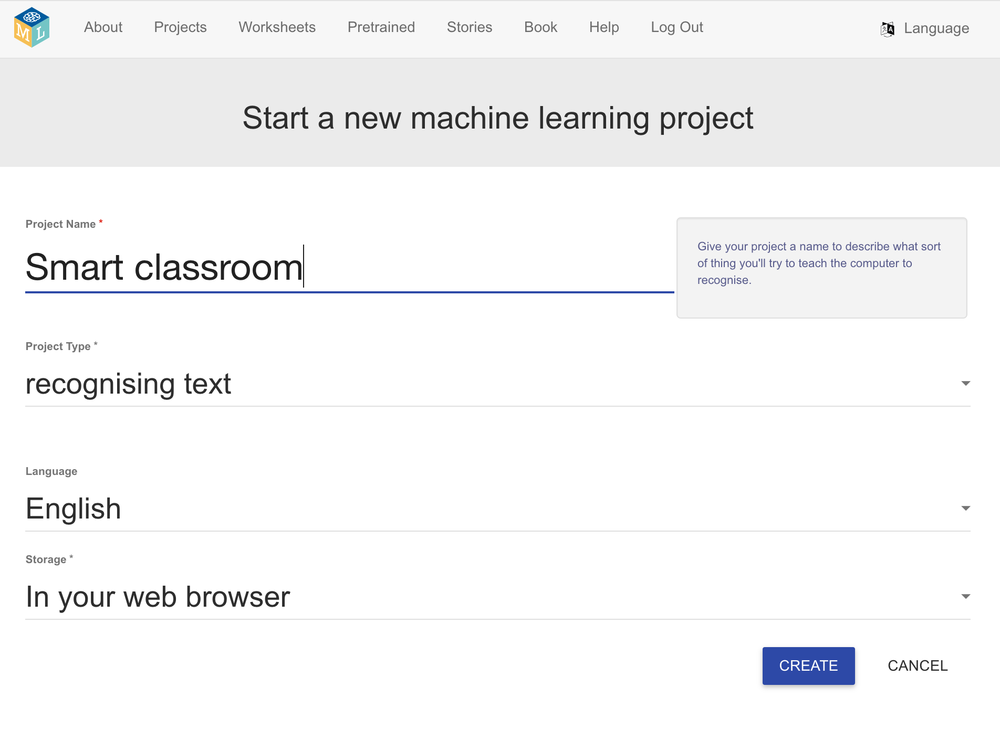

## Set up the project

--- task ---
+ Go to [machinelearningforkids.co.uk](https://machinelearningforkids.co.uk/){:target="_blank"} in a web browser. 

+ Click on **Get Started**

+ Click on **Try it now**.
--- /task ---

--- task ---
+ Click on **Projects** in the menu bar at the top.

+ Click on the **+ Add a new project** button.

+ Name your project 'Smart classroom' and set it to learn to recognise **text**, and store data in **local storage**.  Then click on **Create**.

+ You should now see 'Smart classroom' in the projects list. Click on the project.

--- /task ---

