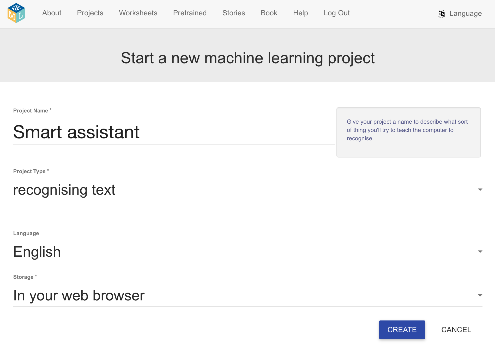
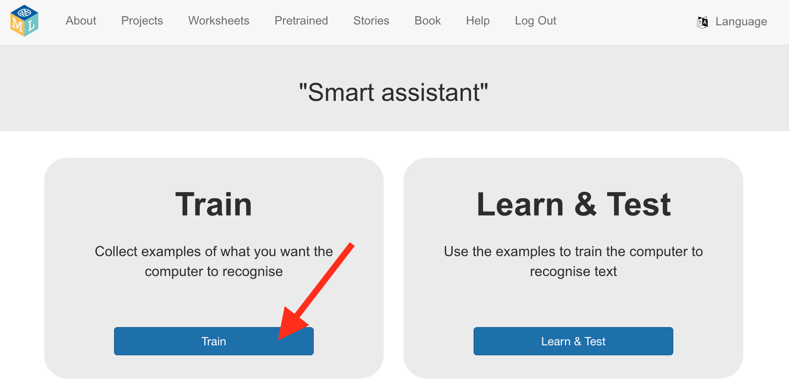

## Set up the project

<html>
  

    <iframe style="position: absolute; top: 0; left: 0; right: 0; width: 100%; height: 100%; border: none;" src="https://www.youtube.com/embed/-y9N-VXW4iE?rel=0&cc_load_policy=1" allowfullscreen allow="accelerometer; autoplay; clipboard-write; encrypted-media; gyroscope; picture-in-picture; web-share"></iframe>
  

</html>

--- task ---
+ Go to [machinelearningforkids.co.uk](https://machinelearningforkids.co.uk/){:target="_blank"} in a web browser. 

+ Click on **Get started**.

+ Click on **Try it now**.
--- /task ---

--- task ---
+ Click on **Projects** in the menu bar at the top.

+ Click on the **+ Add a new project** button.

+ Name your project `Smart assistant` and set it to learn to recognise **text**, and store data **in your web browser**. Then click on **Create**.

+ You should now see 'Smart assistant' in the projects list. Click on the project.

--- /task ---

--- task ---
+ Click on the **Train** button.

--- /task ---
