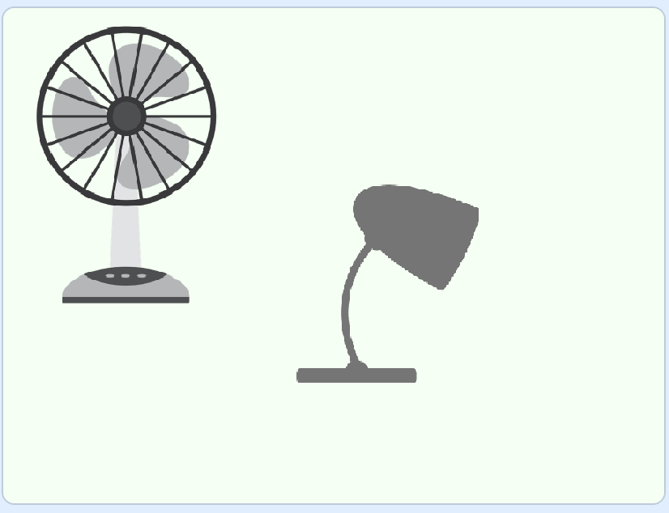
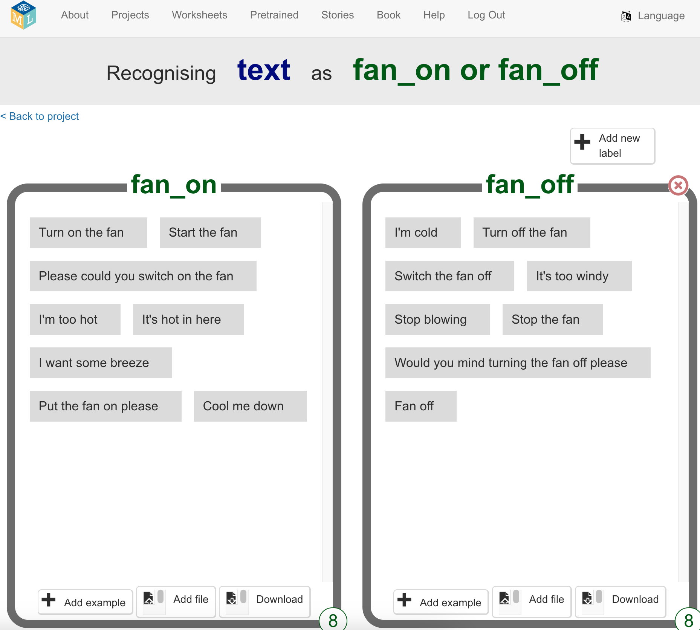

## Example commands

The room has two devices: a fan and a light.

Your assistant needs some examples of the phrases you might say when you want each device to be turned on or off. For example, to **turn the fan on**, you might say:

+ "Turn on the fan"
+ "Start the fan"
+ "Please could you switch on the fan"
+ "I'm too hot"
+ "It's hot in here"

--- task ---
+ Click on **+ Add new label** on the top right and add the label “fan on”. 

--- /task ---

--- task ---
+ Click on **Add example** and type in "Turn on the fan".
--- /task ---

--- task ---
+ Continue to click on the **Add example** button and add different ways of asking for the fan to be turned on until you have eight different ways of asking.
--- /task ---

--- task ---
+ Click on **Add new label**, but this time create the label "fan off". Add eight different examples of ways you could ask for the fan to be turned off.
--- /task ---

