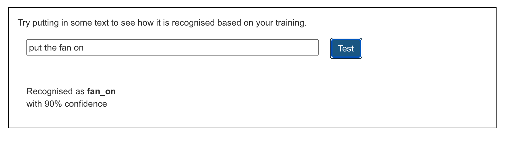

## Train the model

<html>

<iframe style="position: absolute; top: 0; left: 0; right: 0; width: 100%; height: 100%; border: none;" src="https://www.youtube.com/embed/GNy5QF9Az9w?rel=0&cc_load_policy=1" width="560" height="315" allowfullscreen allow="accelerometer; autoplay; clipboard-write; encrypted-media; gyroscope; picture-in-picture; web-share"></iframe>

</html>

Now that you have some example data, you can train the machine learning model to label a command as either 'fan on' or 'fan off' based on your examples.

--- task ---
+ Click on the **< Back to project** link, then click on **Learn & Test**.
--- /task ---

--- task ---
+ Click on the **Train new machine learning model** button. 
--- /task ---

Wait for the training to complete — this might take a minute or two. Once the training has completed, a test box appears. 

--- task ---
+ Type in `put the fan on` and check that the model labels this input as 'fan on'.

--- /task ---

--- task ---
+ Try typing in some other commands for turning the fan on and off, and check that they are given the label you expect. 

--- /task ---

If you’re not happy with how the computer recognises the commands, go back to the previous step and add some more examples. Then **train new machine learning model** again.

