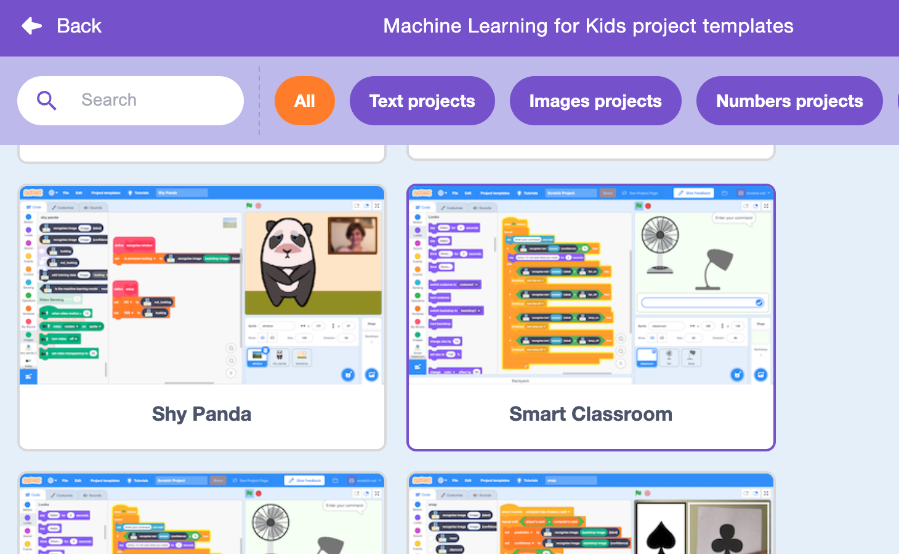
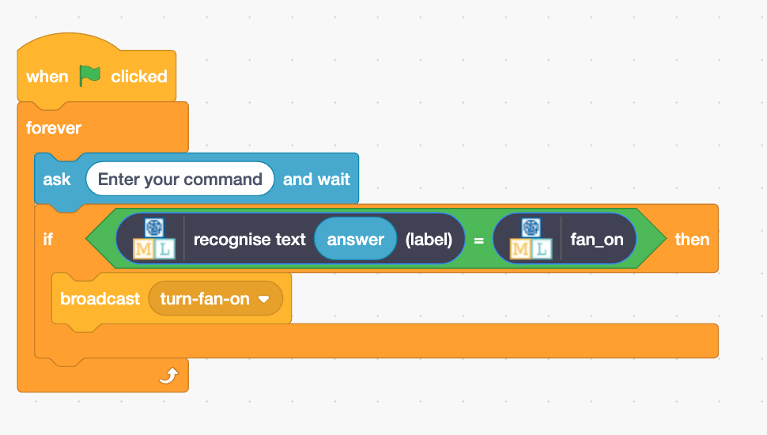

## Create the assistant

Now that your model can distinguish between commands, you can use it in a Scratch program to create your virtual assistant.

--- task ---
+ Click on the **< Back to project** link.

+ Click on **Make**.

+ Click on **Scratch 3**.

+ Click on **Open in Scratch 3**.

--- /task ---

--- task ---
+ Click on **Project templates** at the top and select the 'Smart classroom' project to load the fan and light sprites. 

--- /task ---

Machine Learning for Kids has added some special blocks to Scratch to allow you to use the model you just trained. 

--- task ---

+ Click on the **Code** tab and add this code:

--- /task ---

--- task ---

+ Right click on the `if` block and select 'Duplicate' to add a copy of this block of code. Change the copy so that it recognises the text for turning the fan **off**, and broadcasts **fan off**.

--- /task ---

--- task ---
+ Click the **green flag** and type in a command to turn the fan on or off. Check that it has the result you expected. 

Make sure you test that the assistant performs the correct action **even for commands that you didn’t include as examples.**

--- /task ---
