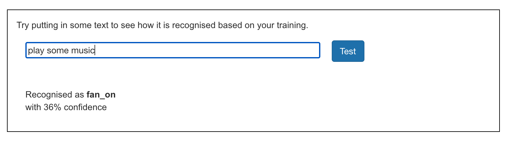
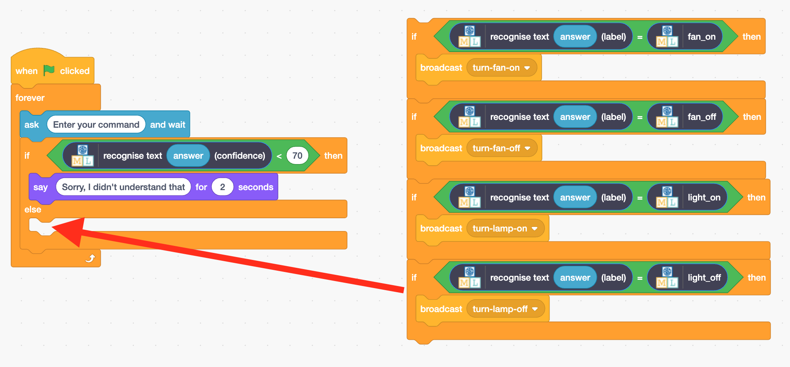

## Confidence scores
<html>
  

    <iframe style="position: absolute; top: 0; left: 0; right: 0; width: 100%; height: 100%; border: none;" src="https://www.youtube.com/embed/5j9g5LQaMXM?rel=0&cc_load_policy=1" allowfullscreen allow="accelerometer; autoplay; clipboard-write; encrypted-media; gyroscope; picture-in-picture; web-share"></iframe>
  

</html>

5j9g5LQaMXM

The model can tell you how **confident** it is about whether it is correct.

--- task ---

+ Go back to the **Learn & Test** page in the training tool.

+ Type something that has nothing to do with lamps or fans into the test box. For example, you could type in 'play some music'.

--- /task ---

The **confidence score** is the program’s way of telling you how likely it is that it has labelled the command correctly. 

--- task ---

+ Return to Scratch.

+ Add some new code so that the assistant will tell you it didn't understand the command if the confidence score is less than 70%.

--- /task ---

--- task ---
+ Click the **green flag** and test your program to check that your  assistant reacts in the right way:
    + Type in commands that have nothing to do with the fan or lamp
    + Ask for something to be turned on or off
--- /task ---
