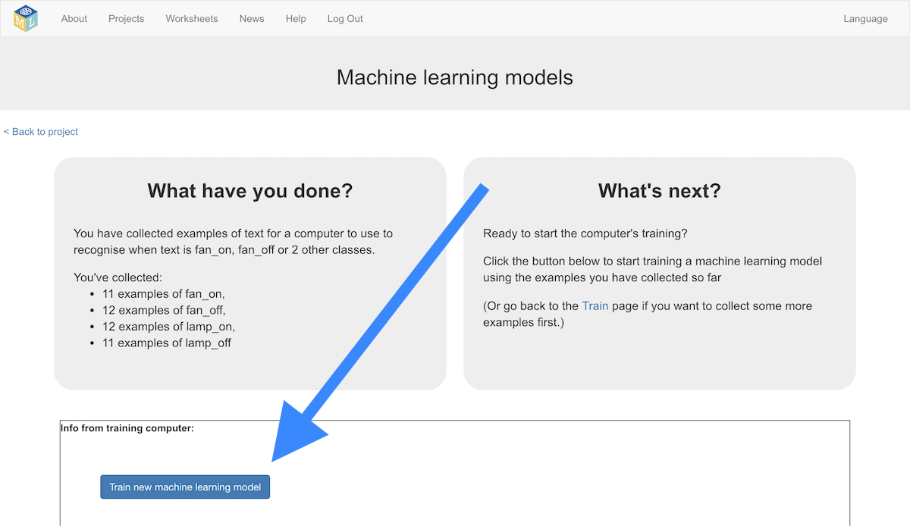
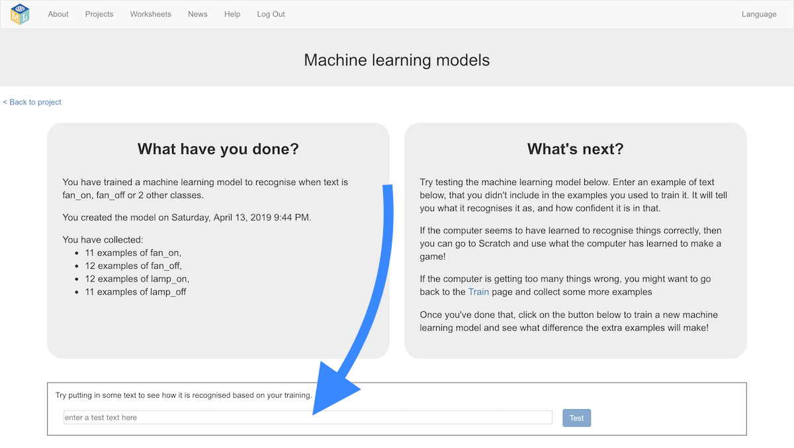

## Train and test a machine learning model

You will now train the program using the examples, and then test it.

The program will learn from patterns in the examples you give it, such as the choice of words and the way sentences are structured. Then, based on the patterns the program finds, it can interpret new commands.

\--- task \---
+ Click on the **< Back to project** link, then click on **Learn & Test**.

+ Click on the **Train new machine learning model** button. If you have enough examples, the program should start to learn how to recognise commands from these examples.

 \--- /task \---

Wait for the training to complete. This might take a minute or two. While you wait, complete the machine-learning multi-choice quiz at the bottom of the page.

\--- task \--- Once the training has completed, a test box appears. Test your machine learning model to see what it has learned.

+ Type in one of the commands you added to a bucket, and then press <kbd>Enter</kbd>. The command should be recognised.

+ Type in **commands that are not in the buckets**.

If you’re not happy with how the computer recognises the commands, go back to the previous step and add some more examples. Then **train new machine learning model** again.

 \--- /task \---

Instead of writing rules for the program, you are giving the program examples. The program uses the examples to train a machine learning **model**.

Because you are supervising the program's training by giving examples, this machine learning approach is called **supervised learning**.