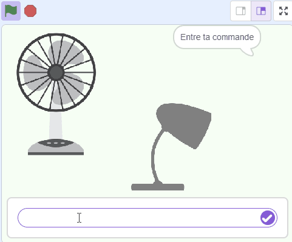

## Ce que tu vas faire

Crée un assistant virtuel intelligent qui réagit aux commandes.

--- collapse ---

---
title: Où sont stockées mes commandes ?
---

- Ce projet utilise une technologie appelée « apprentissage automatique ». Les systèmes d'apprentissage automatique sont entraînés à l'aide d'une grande quantité de données.
- Ce projet ne nécessite pas la création d'un compte ou d'une connexion. Pour ce projet, les exemples que tu utilises pour réaliser le modèle ne sont stockés que temporairement dans ton navigateur (uniquement sur ta machine).
--- /collapse ---
--- collapse ---
---
title: Pas de YouTube ? Télécharge les vidéos !
---

Tu peux [télécharger l'ensemble des vidéos de ce projet](https://rpf.io/p/fr-FR/smart-assistant-go){:target="_blank"}.

--- /collapse ---

--- collapse ---
---
title: Licence
---

Ce projet fait l'objet d'une double licence, à la fois sous une licence [Creative Commons Attribution Non-Commercial Share-Alike License](http://creativecommons.org/licenses/by-nc-sa/4.0/){:target="_blank"} et une licence [Apache License Version 2.0](http://www.apache.org/licenses/LICENSE-2.0){:target="_blank"}.

Nous aimerions remercier Dale de machinelearningforkids.co.uk pour tout son travail sur ce projet.

--- /collapse ---