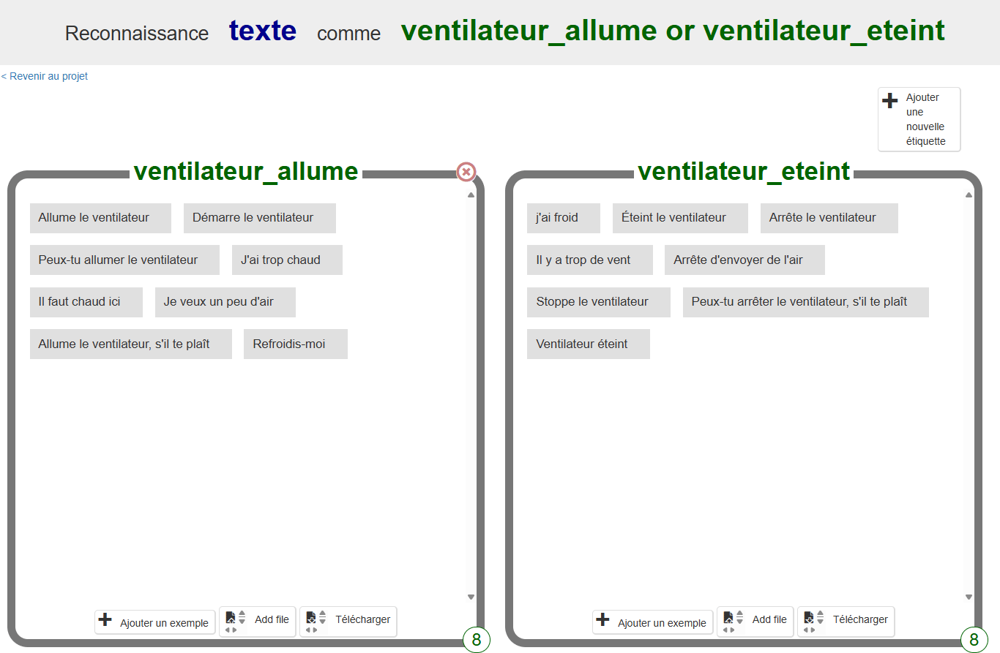

## Exemples de commandes

<html>
  

    <iframe style="position: absolute; top: 0; left: 0; right: 0; width: 100%; height: 100%; border: none;" src="https://www.youtube.com/embed/aekrXl_-Q_o?rel=0&cc_load_policy=1" allowfullscreen allow="accelerometer; autoplay; clipboard-write; encrypted-media; gyroscope; picture-in-picture; web-share"></iframe>
  

</html>

La pièce dispose de deux appareils : un ventilateur et une lampe.

Ton assistant a besoin de quelques exemples de phrases que tu pourrais dire lorsque tu souhaites que chaque appareil soit allumé ou éteint. Par exemple, pour **allumer le ventilateur**, tu pourrais dire :

- « Allume le ventilateur »
- « Démarre le ventilateur »
- « Peux-tu allumer le ventilateur, s'il te plaît ? »
- « J'ai trop chaud »
- « Il fait chaud ici »

\--- task ---

- Clique sur **+ Ajouter une nouvelle étiquette** en haut à droite et ajoute l’étiquette « ventilateur_allume ».

\--- /task ---

\--- task ---

- Clique sur **Ajouter un exemple** et tape « Allume le ventilateur ».

\--- /task ---

\--- task ---

- Continue à cliquer sur le bouton **Ajouter un exemple** et pense à différentes façons de demander que le ventilateur soit allumé, jusqu'à ce que tu aies huit façons différentes de le demander.

\--- /task ---

\--- task ---

- Clique sur **Ajouter une nouvelle étiquette**, mais cette fois, crée l'étiquette « ventilateur_eteint ». Ajoute huit exemples différents de façons de demander l'arrêt du ventilateur.

\--- /task ---

