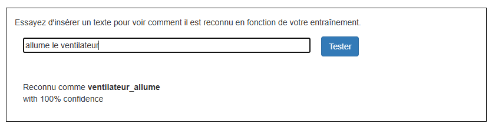

## Entraîner le modèle

<html>
  

    <iframe style="position: absolute; top: 0; left: 0; right: 0; width: 100%; height: 100%; border: none;" src="https://www.youtube.com/embed/62B6yHRVmmg?rel=0&cc_load_policy=1" allowfullscreen allow="accelerometer; autoplay; clipboard-write; encrypted-media; gyroscope; picture-in-picture; web-share"></iframe>
  

</html>

Maintenant que tu disposes de quelques exemples de données, tu peux entraîner le modèle d'apprentissage automatique à étiqueter une commande comme « ventilateur allumé » ou « ventilateur éteint » sur la base de tes exemples.

\--- task ---

- Clique sur le lien **< Revenir au projet**, puis clique sur **Apprendre & Tester**.

\--- /task ---

\--- task ---

- Clique sur le bouton **Entraîner un nouveau modèle d'apprentissage automatique**.

\--- /task ---

Attends que l'entraînement soit terminé — cela peut prendre une minute ou deux. Une fois l'entraînement terminé, une boîte de test apparaît.

\--- task ---

- Tape `allume le ventilateur` et vérifie que le modèle indique cette entrée comme « ventilateur allumé ».
  

\--- /task ---

\--- task ---

- Essaie de taper d'autres commandes pour allumer et éteindre le ventilateur, et vérifie qu'ils reçoivent l'étiquette attendue.

\--- /task ---

Si tu n'es pas satisfait·e de la façon dont l’ordinateur reconnaît les commandes, reviens à l’étape précédente et ajoute quelques exemples supplémentaires. Puis **Entraîner un nouveau modèle d'apprentissage automatique** de nouveau.

