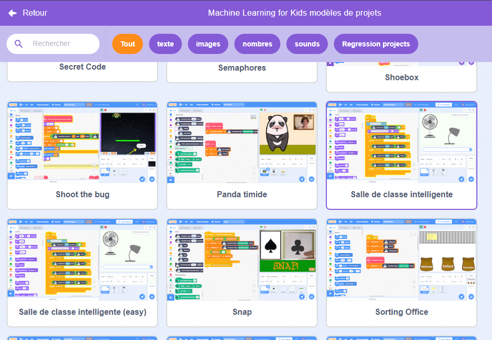
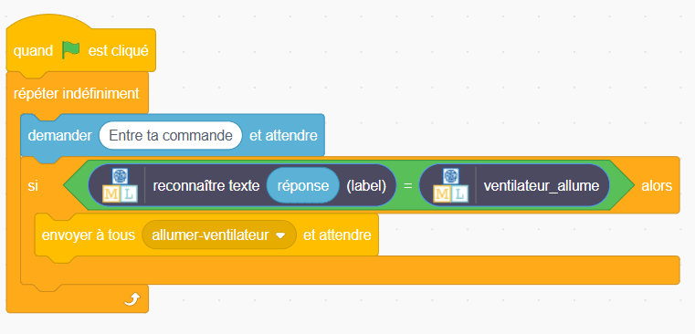
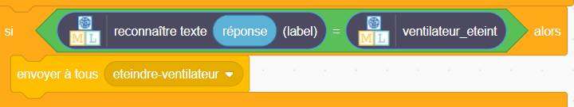

## Créer l'assistant

<html>
  

    <iframe style="position: absolute; top: 0; left: 0; right: 0; width: 100%; height: 100%; border: none;" src="https://www.youtube.com/embed/R3e8nX4vKXo?rel=0&cc_load_policy=1" allowfullscreen allow="accelerometer; autoplay; clipboard-write; encrypted-media; gyroscope; picture-in-picture; web-share"></iframe>
  

</html>

Maintenant que ton modèle peut distinguer les commandes, tu peux l'utiliser dans un programme Scratch pour créer ton assistant intelligent.

--- task ---

- Clique sur le lien **< Revenir au projet**.

- Clique sur **Faire**.

- Clique sur **Scratch 3**.

- Clique sur **Ouvrir dans Scratch 3**.

--- /task ---

--- task ---

- Clique sur **Modèles de projets** en haut et sélectionne le projet « Salle de classe intelligente » pour charger les sprites de ventilateur et de lampe. Ce projet contient également des blocs « envoyer à tous » jaunes prédéfinis, qui se trouvent sous **Événements**.

--- /task ---

Machine Learning for Kids a ajouté des blocs spéciaux à Scratch pour te permettre d'utiliser le modèle que tu viens d'entraîner. Trouve-les en bas de la liste des blocs.

--- task ---

- Assurez-toi d'avoir sélectionné le sprite **Salle de classe**, puis clique sur l'onglet Code et ajoute ce code :

--- /task ---

--- task ---

- Fais un clic droit sur le bloc « si » et sélectionne **Dupliquer** pour ajouter une copie de l'ensemble du bloc de code et place-le directement sous le premier « si ».

- Modifie la deuxième copie du bloc afin qu'elle reconnaisse le texte pour éteindre le ventilateur **éteint** et envoyer à tous **eteindre-ventilateur**.

--- /task ---

--- task ---

- Clique sur le **drapeau vert** et tape une commande pour allumer ou éteindre le ventilateur. Vérifie que cela donne le résultat attendu.

- Assure-toi de tester que l'assistant exécute l'action correcte **même pour les commandes que tu n'as pas incluses comme exemples**.

--- /task ---
