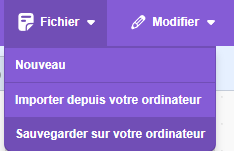

## Défi

\--- challenge ---

Suis les mêmes étapes que précédemment pour permettre à l’assistant de contrôler également la lumière.

\--- task ---

- Enregistre une copie de ton projet Scratch sur ton ordinateur afin de pouvoir facilement le recharger ultérieurement pour l'utiliser avec ton nouveau modèle.

\--- /task ---

\--- task ---

- Reviens à ton modèle (**Revenir au projet** > **Entraîner**) et ajoute deux autres étiquettes : `allumer-lumiere` et `eteindre-lumiere`.

\--- /task ---

\--- task ---

- Ajoute huit exemples de commandes que tu pourrais utiliser pour allumer la lumière.

\--- /task ---

\--- task ---

- Ajoute huit exemples de commandes que tu pourrais utiliser pour éteindre la lumière.

\--- /task ---

\--- task ---

- Réentraîne ton modèle (**Revenir au projet** > **Apprendre & Tester**) afin qu'il puisse également reconnaître les commandes permettant d'allumer et d'éteindre la lumière.

\--- /task ---

\--- task ---

- Charge ton nouveau modèle dans Scratch (**Faire** > **Scratch 3** > **Ouvrir dans Scratch 3**).

- Dans Scratch, recharge le code que tu as sauvegardé précédemment (**Fichier** > **Importer depuis votre ordinateur**).

- Ajoute deux autres blocs « si » à ton programme afin de pouvoir taper des commandes pour contrôler la lumière.

## --- collapse ---

## title: Je ne vois pas les blocs pour allumer-lumiere / eteindre-lumiere

Si tu as entraîné un nouveau modèle, tu devras fermer Scratch, puis le rouvrir à partir du site web Machine Learning for Kids pour que de nouveaux blocs apparaissent.

Clique sur **Faire** > **Scratch 3** > **Ouvrir dans Scratch 3**.

\--- /collapse ---

\--- /task ---

\--- task ---

- Teste si ton programme fonctionne en tapant des commandes pour allumer et éteindre la lumière et en vérifiant si c'est le résultat attendu.

\--- /task ---

\--- /challenge ---
