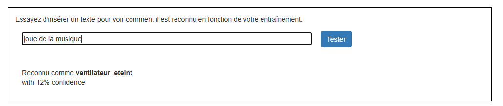
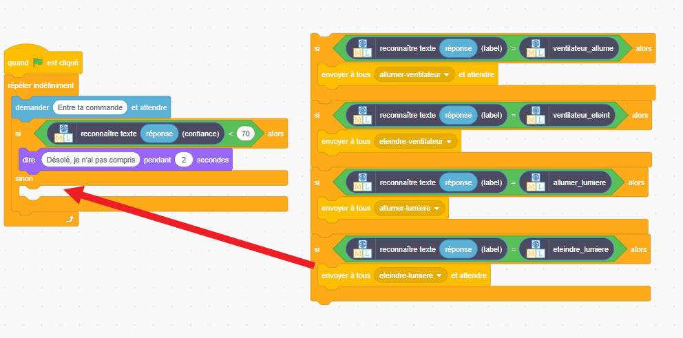

## Score de confiance

<html>
  

    <iframe style="position: absolute; top: 0; left: 0; right: 0; width: 100%; height: 100%; border: none;" src="https://www.youtube.com/embed/ZvRBzkMUDlM?rel=0&cc_load_policy=1" allowfullscreen allow="accelerometer; autoplay; clipboard-write; encrypted-media; gyroscope; picture-in-picture; web-share"></iframe>
  

</html>

Le modèle peut t'indiquer à quel point il est **confiant** quant à son exactitude.

--- task ---

- Retourne à la page **Apprendre & Tester** dans l’outil d'entraînement.

- Tape quelque chose qui n’a rien à voir avec les lampes ou les ventilateurs dans la zone de test. Par exemple, tu peux taper « joue de la musique ».

--- /task ---

Le **score de confiance** est la façon dont le programme te dit à quel point il est probable qu'il ait étiqueté la commande correctement.

--- task ---

- Reviens dans Scratch.

- Ajoute un nouveau code pour que l'assistant t'indique qu'il n'a pas compris la commande si le score de confiance est inférieur à 70 %.

--- /task ---

--- task ---

- Clique sur le **drapeau vert** et teste ton programme pour vérifier que ton assistant réagit de la bonne manière :
  - Tape des commandes qui n’ont rien à voir avec le ventilateur ou la lampe
  - Demande que quelque chose soit allumé ou éteint

--- /task ---
