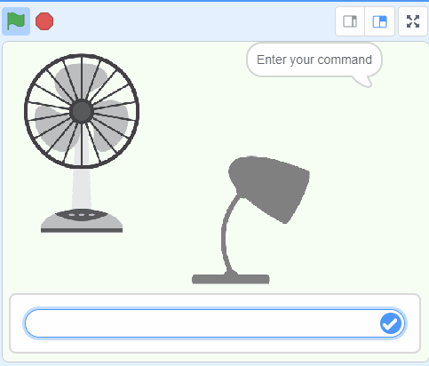

## Wat ga je maken

Create a smart virtual assistant that reacts to your commands.

\--- collapse ---

---

## title: Where are my commands stored?

- This project uses a technology called 'machine learning'. Machine learning systems are trained using a large amount of data.
- This project does not require you to create an account or log in. For this project, the examples you use to make the model are only stored temporarily in your browser (only on your machine).
  \--- /collapse ---

## --- collapse ---

## title: No YouTube? Download the videos!

You can [download all the videos for this project](https://rpf.io/p/en/smart-assistant-go){:target="_blank"}.

\--- /collapse ---

## --- collapse ---

## Licentie

Dit project heeft een dubbele licentie onder zowel een [Creative Commons Attribution Non-Commercial Share-Alike-licentie](http://creativecommons.org/licenses/by-nc-sa/4.0/){:target="_blank"} en een [Apache-licentie versie 2.0](http://www.apache.org/licenses/LICENSE-2.0){:target="_blank"}.

We willen Dale van machinelearningforkids.co.uk graag bedanken voor al zijn werk aan dit project.

\--- /collapse ---
