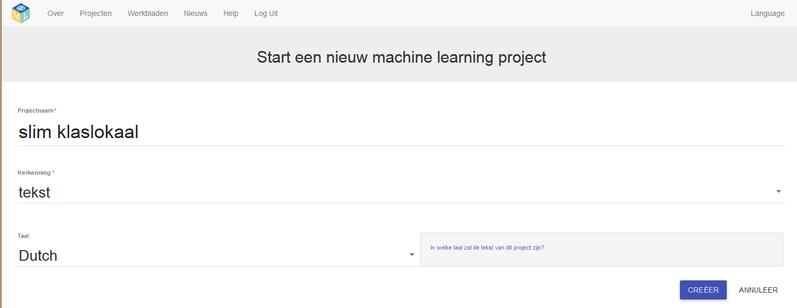
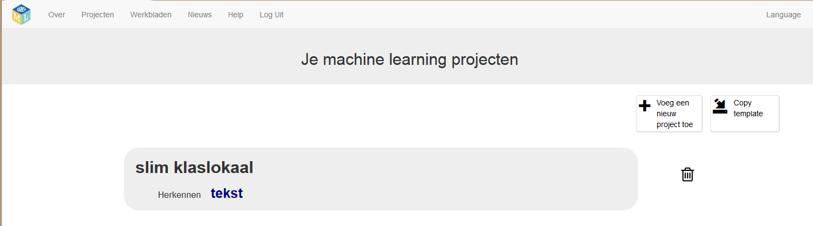

## Het project opzetten

<html>
  

    <iframe style="position: absolute; top: 0; left: 0; right: 0; width: 100%; height: 100%; border: none;" src="https://www.youtube.com/embed/aTKd6sH3PhM?rel=0&cc_load_policy=1" allowfullscreen allow="accelerometer; autoplay; clipboard-write; encrypted-media; gyroscope; picture-in-picture; web-share"></iframe>
  

</html>

\--- task ---

- Ga naar [machinelearningforkids.co.uk](https://machinelearningforkids.co.uk/?lang=nl-be){:target="_blank"} in een webbrowser.

- Klik op **Begin**

- Klik op **Probeer nu**.

\--- /task ---

\--- task ---

- Klik op **Projecten** in de menubalk bovenaan.

- Klik op de knop **+ Voeg een nieuw project toe**.

- Geef je project de naam 'Slimme assistent', stel het in om **tekst** te leren herkennen, en sla de data op **in jouw webbrowser**. Klik vervolgens op **Creëer**.
  

- Je zou nu 'Slimme assistent' moeten zien in de projectenlijst. Klik op dit project.
  

\--- /task ---

\--- task ---

- Klik op de knop **Train**.
  

\--- /task ---
