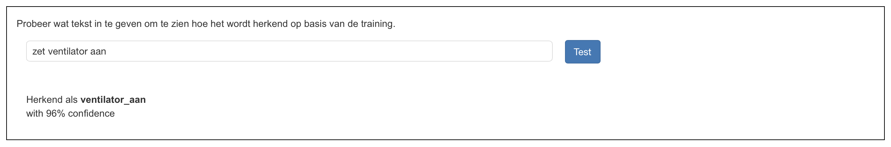

## Train het model

<html>
  

    <iframe style="position: absolute; top: 0; left: 0; right: 0; width: 100%; height: 100%; border: none;" src="https://www.youtube.com/embed/62B6yHRVmmg?rel=0&cc_load_policy=1" allowfullscreen allow="accelerometer; autoplay; clipboard-write; encrypted-media; gyroscope; picture-in-picture; web-share"></iframe>
  

</html>

Nu je een paar voorbeeldgegevens hebt kun je het machine learning model trainen om een commando te labelen als 'ventilator aan' of 'ventilator uit' op basis van je voorbeelden.

\--- task ---

- Klik op de link **< Terug naar project**, en klik dan op **Leer & Test**.

\--- /task ---

\--- task ---

- Klik op de knop **Train nieuw machine learning model**.

\--- /task ---

Wacht tot de training klaar is - dit kan een paar minuten duren. Nadat de training is voltooid, verschijnt een testvak.

\--- task ---

- Typ `zet de ventilator aan` en controleer of het model deze invoer als `ventilator aan` labelt.
  

\--- /task ---

\--- task ---

- Probeer andere commando's in te voeren om de ventilator aan en uit te zetten, en controleer of ze het label krijgen dat je verwacht.

\--- /task ---

Als je niet tevreden bent met hoe de computer de opdrachten herkent, ga je terug naar de vorige stap en voeg je nog enkele voorbeelden toe. **Train** dan het **nieuwe machine learning model** opnieuw.

