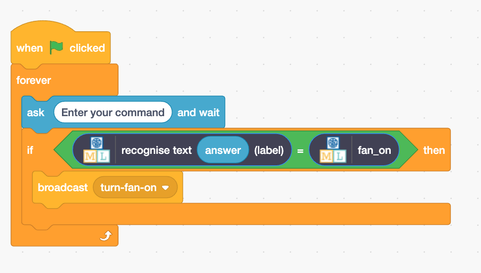

## Maak de assistent

<html>
  

    <iframe style="position: absolute; top: 0; left: 0; right: 0; width: 100%; height: 100%; border: none;" src="https://www.youtube.com/embed/R3e8nX4vKXo?rel=0&cc_load_policy=1" allowfullscreen allow="accelerometer; autoplay; clipboard-write; encrypted-media; gyroscope; picture-in-picture; web-share"></iframe>
  

</html>

Nu je model onderscheid kan maken tussen commando's, kun je het gebruiken in een Scratch programma om je slimme assistent te maken.

\--- task ---

- Klik op de link **< Terug naar project** en klik vervolgens op **Leer & Test**.

- Klik op **Maak**.

- Klik op **Scratch 3**.

- Klik op **Open in Scratch 3**.

\--- /task ---

\--- task ---

- Klik bovenaan op **Projectsjablonen** en selecteer het project 'Slim klaslokaal' om de ventilator- en lamp sprites te laden. Dit project bevat ook kant-en-klare gele `gebeurtenis` blokken, die je kunt vinden onder **Gebeurtenissen**.

\--- /task ---

Machine Learning for Kids heeft een paar speciale blokken aan Scratch toegevoegd om het model dat je net hebt getraind te kunnen gebruiken. Je vindt ze onderaan de lijst met blokken.

\--- task ---

- Zorg ervoor dat je de **Klaslokaal** sprite hebt geselecteerd, klik vervolgens op het **Code** tabblad en voeg deze code toe:

\--- /task ---

\--- task ---

- Klik met de rechtermuisknop op het `als`-blok en selecteer **Dupliceren** om een kopie van het volledige codeblok toe te voegen en plaats deze direct onder het eerste `als`-blok.

- Verander de tweede kopie van het blok, zodat het de tekst herkent voor het **uit**schakelen van de ventilator, en zend **zet-ventilator-uit**.

\--- /task ---

\--- task ---

- Klik op de **groene vlag** en typ een opdracht om de ventilator aan of uit te zetten. Controleer of het resultaat is wat je verwachtte.

- Controleer of de assistent de juiste actie uitvoert, **ook voor opdrachten die je niet als voorbeeld hebt opgenomen**.

\--- /task ---
