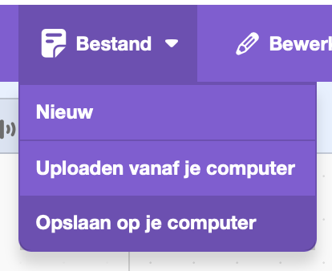

## Challenge

\--- challenge ---

Follow the same steps as before to allow the assistant to also control the light.

\--- task ---

- Save a copy of your Scratch project to your computer so that you can easily reload it later to use with your new model.

\--- /task ---

\--- task ---

- Go back to your model (**Back to project** > **Train**) and add two more labels: `light_on` and `light_off`.

\--- /task ---

\--- task ---

- Add eight examples of commands you might use to turn the light on.

\--- /task ---

\--- task ---

- Add eight examples of commands you might use to turn the light off.

\--- /task ---

\--- task ---

- Re-train your model (**Back to project** > **Learn and Test**) so that it can also recognise commands for turning the light on and off.

\--- /task ---

\--- task ---

- Klik op **Openen in Scratch 3**.

- Klik op **Bestand** en vervolgens op **Uploaden vanaf je computer**en selecteer het eerder opgeslagen Scratch-project.

- Add two more `if` blocks to your program so that you can type commands to control the light.

## --- /task ---

## title: I can't see the blocks for light_on / light_off

If you have trained a new model, you will need to close Scratch and then re-open it from the Machine Learning for Kids website for any new blocks to appear.

Klik op **Scratch 3**.

\--- /collapse ---

\--- /task ---

\--- task ---

- Test whether your program works by typing in commands to turn the light on and off, and checking whether the outcome is as you expected.

\--- /task ---

\--- /challenge ---
