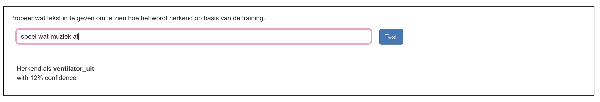
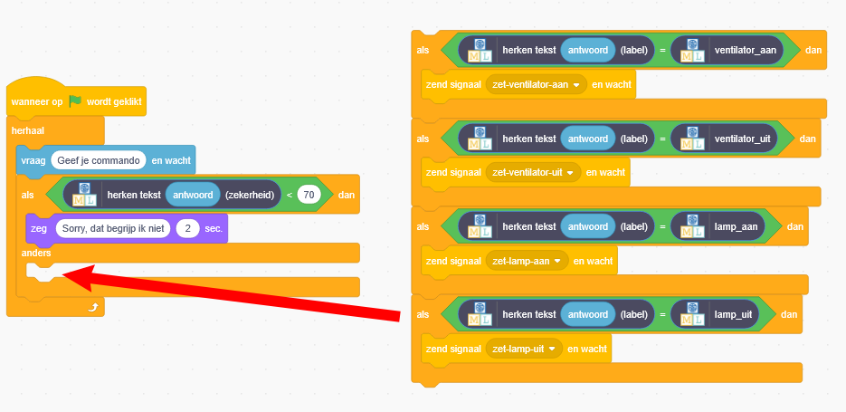

## Betrouwbaarheidsscores

<html>
  

    <iframe style="position: absolute; top: 0; left: 0; right: 0; width: 100%; height: 100%; border: none;" src="https://www.youtube.com/embed/ZvRBzkMUDlM?rel=0&cc_load_policy=1" allowfullscreen allow="accelerometer; autoplay; clipboard-write; encrypted-media; gyroscope; picture-in-picture; web-share"></iframe>
  

</html>

Het model laat je zien hoeveel **vertrouwen** het heeft of het correct is.

\--- task ---

- Ga terug naar de pagina **Leer & Test** in de trainingstool.

- Typ iets dat niets te maken heeft met lampen of ventilatoren in de testbox. Je zou bijvoorbeeld 'speel wat muziek' kunnen typen.

\--- /task ---

De **betrouwbaarheidsscore** is de manier waarop het programma aangeeft hoe waarschijnlijk het is dat het de opdracht correct heeft gelabeld.

\--- task ---

- Ga terug naar Scratch.

- Voeg wat nieuwe code toe, zodat de assistent je vertelt dat hij de opdracht niet heeft begrepen als de betrouwbaarheidsscore lager is dan 70%.

\--- /task ---

\--- task ---

- Klik op de **groene vlag** en test je programma om te controleren of jouw assistent op de juiste manier reageert:
  - Typ opdrachten in die niets met de ventilator of lamp te maken hebben
  - Vraag om iets aan of uit te zetten

\--- /task ---
