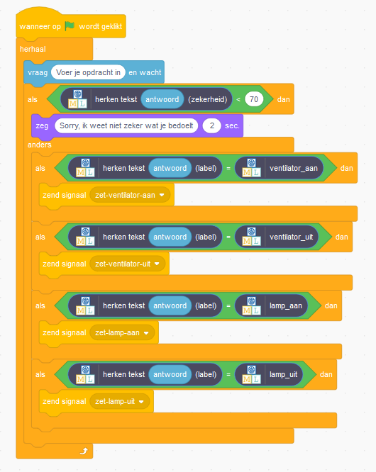

## Confidence scores

<html>
  

    <iframe style="position: absolute; top: 0; left: 0; right: 0; width: 100%; height: 100%; border: none;" src="https://www.youtube.com/embed/ZvRBzkMUDlM?rel=0&cc_load_policy=1" allowfullscreen allow="accelerometer; autoplay; clipboard-write; encrypted-media; gyroscope; picture-in-picture; web-share"></iframe>
  

</html>

The model can tell you how **confident** it is about whether it is correct.

\--- task ---

- Ga terug naar de pagina **Leer & Test** in de trainingstool.

- Typ iets dat niets te maken heeft met lampen of ventilatoren in de testbox. Je kunt bijvoorbeeld typen 'geef me een boterham met kaas'.

\--- /task ---

**De betrouwbaarheidsscore is de manier van het programma om je te vertellen hoe zeker het is dat het een opdracht begrijpt.** Als een opdracht erg lijkt op de voorbeelden waarmee je het programma hebt getraind, is de betrouwbaarheidsscore hoog.

\--- task ---

- Laat Scratch open, want je komt zo terug.

- Add some new code so that the assistant will tell you it didn't understand the command if the confidence score is less than 70%.

\--- /task ---

\--- task ---

- Klik op de groene vlag en test je programma om te controleren of jouw klassenassistent op de juiste manier reageert:
  - Typ opdrachten in die niets met de ventilator of lamp te maken hebben
  - Vraag om iets aan of uit te zetten

\--- /task ---
