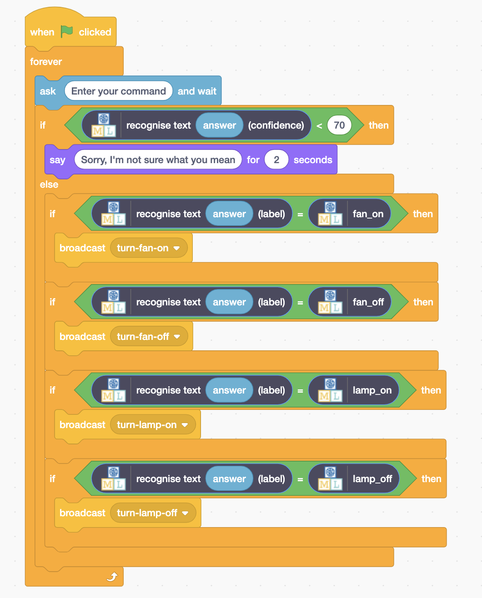

## How to use confidence scores

Finally, you will learn about what confidence scores mean and how you should use them.

\--- task \---
+ Leave Scratch open, because you will come back in a moment.

+ Go back to the **Learn & Test** page in the Training tool.

+ Type something that has nothing to do with lamps or fans into the test box. For example, you could type in 'make me a cheese sandwich'. 

+ Look at the confidence score, which should be very low.

+ Compare this with the confidence score you get for a command such as “turn on the lamp”.

**The confidence score is the program’s way of telling you how certain it is that it understands a command.** If a command is very similar to the examples you have trained the program with, the confidence score is high. If a command is **not** similar, the confidence score is low.

\--- /task \---

\--- task \---

+ Go back to your classroom assistant project in Scratch.

+ Modify the script for the 'classroom' sprite so that it uses the confidence score:

+ Click the green flag and test your program to check that your classroom assistant reacts in the right way:
    + Type in commands that have nothing to do with the fan or lamp
    + Ask for something to be turned on or off

Now, if your program is not sure what you mean, it tells you so. Then you can try giving it another command. \--- /task \---

You’ve used machine learning to train a smart assistant that is a simple version of the assistants you can get on smartphones (e.g. Apple’s Siri or Google’s Assistant) or at home (e.g. Amazon’s Alexa or Google’s Home).

Training the program to recognise commands is much easier than trying to make a list of every possible command. And the more examples you give the program, the better it gets at recognising commands, and the more its confidence scores increase. 