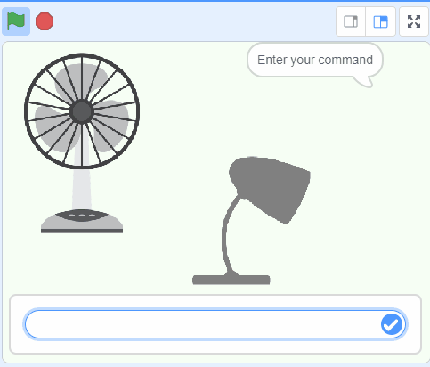

## O que vais fazer

Cria um assistente virtual que reaja aos teus comandos.

\--- collapse ---

---

## title: Onde estão guardadas as minhas imagens?

- Este projeto usa uma tecnologia chamada 'machine learning'. Os sistemas de machine learning são treinados com uma grande quantidade de dados.
- Este projeto não exige que cries uma conta ou faças login. Para este projeto, os exemplos que usas para fazer o modelo são armazenados temporariamente no teu navegador (apenas na tua máquina).
  \--- /collapse ---

## --- collapse ---

## title: Não tens Youtube? Descarrega estes vídeos!

Podes [descarregar todos os vídeos para este projeto](https://rpf.io/p/en/smart-assistant-go){:target="_blank"}.

\--- /collapse ---

## --- collapse ---

## title: Licença

Este projeto possui duplo licenciamento sob a [Creative Commons Attribution Non-Commercial Share-Alike License](http://creativecommons.org/licenses/by-nc-sa/4.0/){:target="_blank"} e a [Apache License Version 2.0](http://www.apache.org/licenses/LICENSE-2.0){:target="_blank"}.

Gostaríamos de agradecer ao Dale da machinelearningforkids.co.uk por todo o seu trabalho neste projeto.

\--- /collapse ---