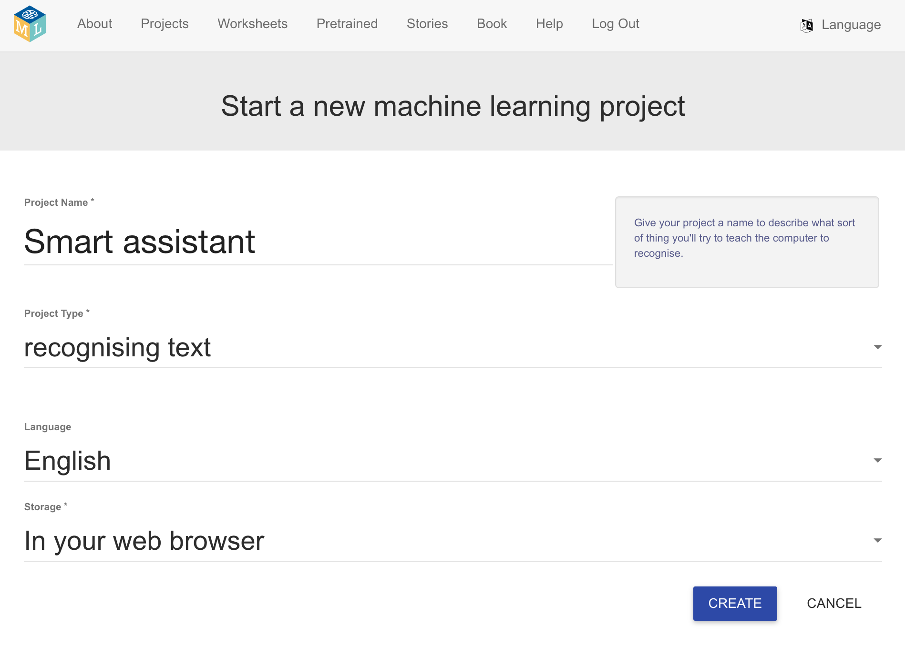

## Prepara o teu projeto

<html>
  

    <iframe style="position: absolute; top: 0; left: 0; right: 0; width: 100%; height: 100%; border: none;" src="https://www.youtube.com/embed/aTKd6sH3PhM?rel=0&cc_load_policy=1" allowfullscreen allow="accelerometer; autoplay; clipboard-write; encrypted-media; gyroscope; picture-in-picture; web-share"></iframe>
  

</html>

\--- task ---

- Vai até [machinelearningforkids.co.uk](https://machinelearningforkids.co.uk/){:target="_blank"} num navegador web.

- Clica em **Começar**.

- Clica em Experimenta agora\*\*.

\--- /task ---

\--- task ---

- Clica em **Projetos** na parte superior da barra do menu.

- Clica no botão **+ Adicionar um novo projeto**.

- Dá ao teu projeto o nome de `Assistente Inteligente` e configura-o para aprender a reconhecer **sons** e armazenar dados **no teu navegador web**. E clica em **Criar**.
  

- Agora, deves ver 'Assistente Inteligente' na tua lista de projetos. Clica no projeto.
  

\--- /task ---

\--- task ---

- Clica no botão **Treinar**.
  

\--- /task ---
