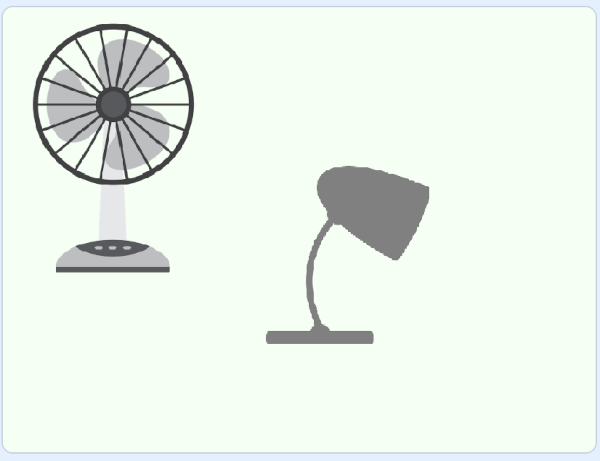
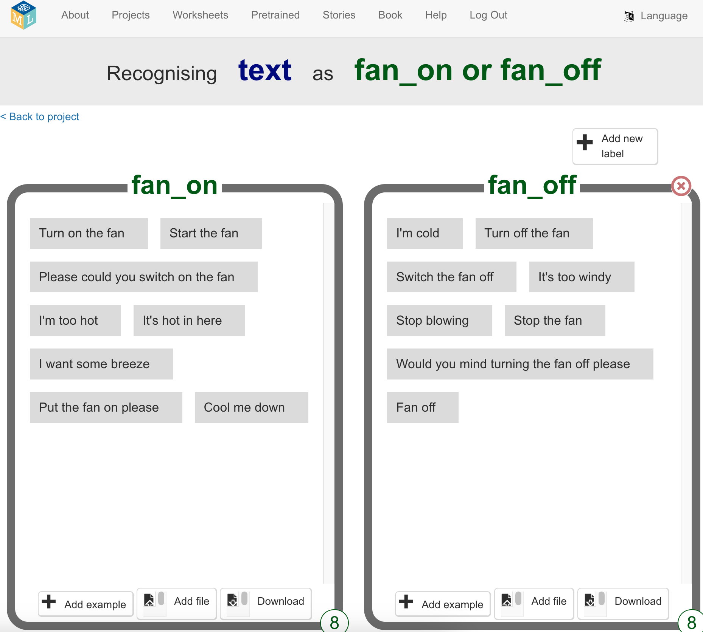

## Exemplos de comando

<html>
  

    <iframe style="position: absolute; top: 0; left: 0; right: 0; width: 100%; height: 100%; border: none;" src="https://www.youtube.com/embed/aekrXl_-Q_o?rel=0&cc_load_policy=1" allowfullscreen allow="accelerometer; autoplay; clipboard-write; encrypted-media; gyroscope; picture-in-picture; web-share"></iframe>
  

</html>

O quarto tem dois aparelhos: um ventilador e uma luz.

O assistente precisa de alguns exemplos de frases que podem ser ditas quando quisermos que cada um dos dispositivos seja ligado ou desligado. Por exemplo, para **ligar o ventilador**, pode dizer-se:

- "Liga o ventilador"
- "Põe o ventilador a funcionar"
- "Podes, por favor, ligar o ventilador"
- "Estou com muito calor"
- "Aqui está calor"

\--- task ---

- Clique em **+ Adicionar novo rótulo** no canto superior direito e adicione o rótulo “ventilador ligado”.

\--- /task ---

\--- task ---

- Clica em **Adicionar exemplo** e escreve `Ligar o ventilador`.

\--- /task ---

\--- task ---

- Continua a clicar no botão **Adicionar exemplo** e adiciona diferentes formas de pedir que o ventilador seja ligado até ter oito formas diferentes de o fazer.

\--- /task ---

\--- task ---

- Clica em **Adicionar novo rótulo**, mas desta vez cria o rótulo "Desligar o ventilador". Adiciona oito exemplos de diferentes formas para pedir para o ventilador seja desligado.

\--- /task ---

