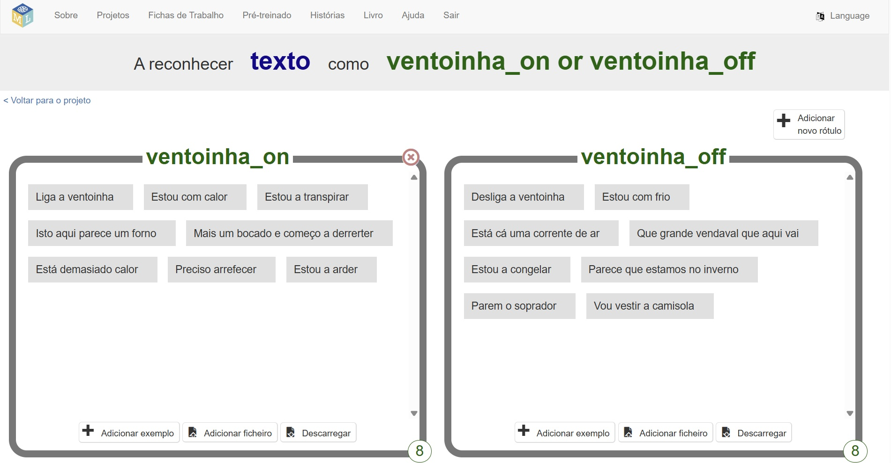

## Exemplos de comando

<html>
  

    <iframe style="position: absolute; top: 0; left: 0; right: 0; width: 100%; height: 100%; border: none;" src="https://www.youtube.com/embed/aekrXl_-Q_o?rel=0&cc_load_policy=1" allowfullscreen allow="accelerometer; autoplay; clipboard-write; encrypted-media; gyroscope; picture-in-picture; web-share"></iframe>
  

</html>

O quarto tem dois aparelhos: uma ventoinha e uma luz.

O assistente precisa de alguns exemplos de frases que podem ser ditas quando quisermos que cada um dos dispositivos seja ligado ou desligado. Por exemplo, para **ligar a ventoinha**, podes dizer:

- "Liga a ventoinha"
- "Põe a ventoinha a funcionar"
- "Podes, por favor, ligar a ventoinha"
- "Estou com muito calor"
- "Está calor aqui"

\--- task ---

- Clica em **+ Adicionar novo rótulo** no canto superior direito e adiciona o rótulo “ventoinha ligada”.

\--- /task ---

\--- task ---

- Clica em **Adicionar exemplo** e escreve "Ligar a ventoinha".

\--- /task ---

\--- task ---

- Continua a clicar no botão **Adicionar exemplo** e adiciona diferentes formas de pedir que seja ligada a ventoinha até ter oito formas diferentes de o fazer.

\--- /task ---

\--- task ---

- Clica em **Adicionar novo rótulo**, mas desta vez cria o rótulo "Desligar a ventoinha". Adiciona oito exemplos para pedir de formas diferentes para a ventoinha ser desligada.

\--- /task ---

