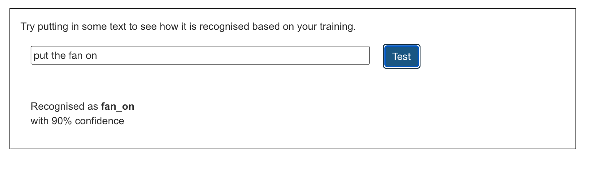

## Treina o modelo

<html>
  

    <iframe style="position: absolute; top: 0; left: 0; right: 0; width: 100%; height: 100%; border: none;" src="https://www.youtube.com/embed/62B6yHRVmmg?rel=0&cc_load_policy=1" allowfullscreen allow="accelerometer; autoplay; clipboard-write; encrypted-media; gyroscope; picture-in-picture; web-share"></iframe>
  

</html>

Agora que já tens alguns dados de exemplo, podes treinar o modelo de Machine Learning para rotular um comando como "ligar ventilador" ou "desligar ventilador" usando os teus exemplos.

\--- task ---

- Clica em 'Voltar para o projeto', depois clica em 'Aprender & Testar\*\*.

\--- /task ---

\--- task ---

- Clica no botão **Treinar novo modelo de Machine Learning**.

\--- /task ---

Aguarda a conclusão do Treino — pode demorar um ou dois minutos. Após a conclusão do Treino, será apresentada uma caixa de teste.

\--- task ---

- Escreve `colocar o ventilador na posição de ligado` e verifica se o modelo rotula esta entrada como 'ventilador ligado'.
  

\--- /task ---

\--- task ---

- Experimenta com outros comandos para ligar e desligar o ventilador e verifica se recebem o rótulo esperado.

\--- /task ---

Se não estiveres satisfeito com a forma como o computador reconhece os comandos, volte ao passo anterior e acrescenta mais alguns exemplos. Clica no botão **Treinar novo modelo de Machine Learning**.

