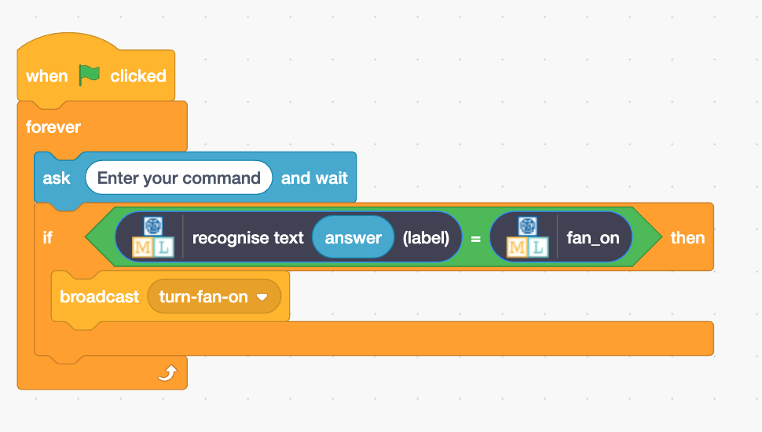
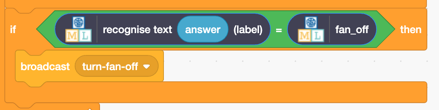

## Cria o teu assistente

<html>
  

    <iframe style="position: absolute; top: 0; left: 0; right: 0; width: 100%; height: 100%; border: none;" src="https://www.youtube.com/embed/R3e8nX4vKXo?rel=0&cc_load_policy=1" allowfullscreen allow="accelerometer; autoplay; clipboard-write; encrypted-media; gyroscope; picture-in-picture; web-share"></iframe>
  

</html>

Agora que o teu modelo consegue distinguir as palavras, podes usá-lo num programa Scratch para criar o teu assistente inteligente.

\--- task ---

- Clica no link **< Voltar para o projeto**.

- Clica em **Fazer**.

- Clica em **Scratch 3**.

- Clica em **Open in Scratch 3**.

\--- /task ---

\--- task ---

- Clique em **Project Templates** na parte superior e seleciona o projeto 'Sala de aula inteligente' para carregar os atores ventilador e luz. Este projeto contém também blocos de `transmissão` amarelos pré-fabricados, que podem ser encontrados em **Eventos**.

\--- /task ---

Machine learning for Kids adicionou alguns blocos especiais ao Scratch para permitir que utilizes o modelo que acabaste de treinar. Encontra-os na última parte da lista de blocos.

\--- task ---

- Certifica-te que tens o ator Sala de Aula selecionado, depois clica no separador Código e adiciona este código:

\--- /task ---

\--- task ---

- Clique com o botão direito do rato no bloco `if` e seleccione **Duplicar** para adicionar uma cópia de todo o bloco de código e colocá-la diretamente abaixo do primeiro `if`.

- Altera a segunda cópia do bloco para que reconheça o texto para desligar o ventilador e transmita **desligar-o-ventilador**.

\--- /task ---

\--- task ---

- Clica na **bandeira verde** e escreve um comando para ligar ou desligar o ventilador. Verifica se o resultado é o esperado.

- Certifica-te de que testas se o assistente executa a ação correta **mesmo para os comandos não incluidos como exemplos**.

\--- /task ---
