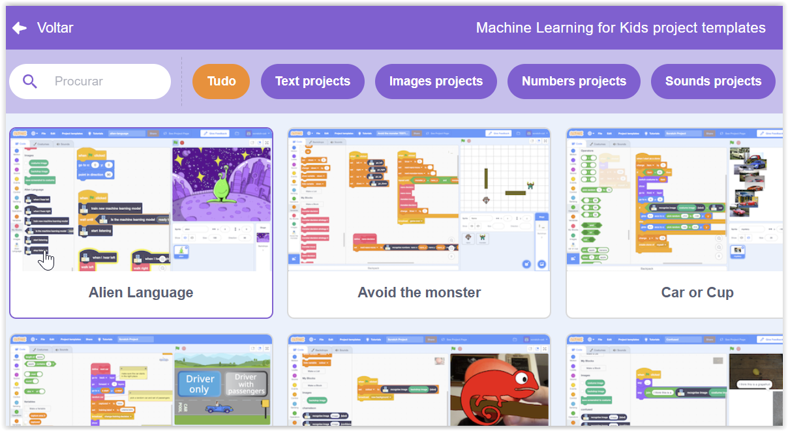
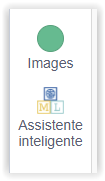
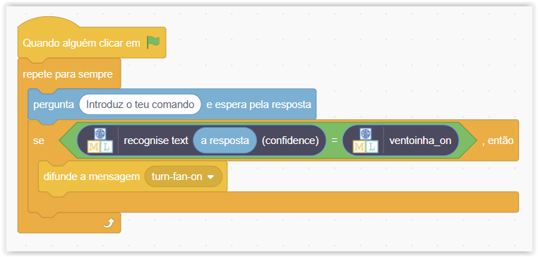
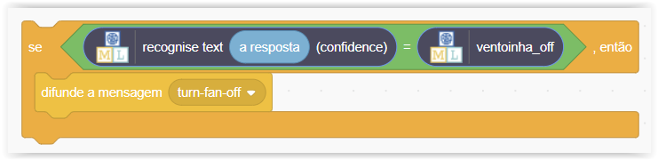

## Cria o teu assistente

<html>
  

    <iframe style="position: absolute; top: 0; left: 0; right: 0; width: 100%; height: 100%; border: none;" src="https://www.youtube.com/embed/R3e8nX4vKXo?rel=0&cc_load_policy=1" allowfullscreen allow="accelerometer; autoplay; clipboard-write; encrypted-media; gyroscope; picture-in-picture; web-share"></iframe>
  

</html>

Agora que o teu modelo consegue distinguir as palavras, podes usá-lo num programa Scratch para criar o teu assistente inteligente.

\--- task ---

- Clica na ligação **< Voltar para o projeto**.

- Clica em **Fazer**.

- Clica em **Scratch 3**.

- Clica em **Abre no Scratch 3**.

\--- /task ---

\--- task ---

- Clica em **Project Templates** na parte superior e seleciona o projeto "Sala de aula inteligente" para carregar os atores ventoinha e luz. Este projeto contém também blocos de "transmissão" amarelos pré-fabricados, que podem ser encontrados em **Eventos**.

\--- /task ---

Machine learning for Kids adicionou alguns blocos especiais ao Scratch para permitir que utilizes o modelo que acabaste de treinar. Encontra-os na última parte da lista de blocos.

\--- task ---

- Certifica-te que tens o ator **Sala de Aula** selecionado, depois clica no separador **Código** e adiciona este código:

\--- /task ---

\--- task ---

- Clica com o botão direito do rato no bloco "se" e seleciona **Duplicar** para adicionar uma cópia de todo o bloco de código e colocá-la diretamente abaixo do primeiro "se".

- Altera a segunda cópia do bloco para que reconheça o texto para desligar a ventoinha e transmita **desligar-ventoinha**.

\--- /task ---

\--- task ---

- Clica na **bandeira verde** e escreve um comando para ligar ou desligar a ventoinha. Verifica se o resultado é o esperado.

- Certifica-te de que testas se o assistente executa a ação correta **mesmo para os comandos não incluídos como exemplos**.

\--- /task ---
