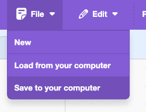

## Desafio

\--- challenge ---

Segue os passos anteriores para fazer com que o assistente controle também a luz.

\--- task ---

- Guarde uma cópia do teu projeto Scratch no seu computador para que possas recarregá-lo facilmente mais tarde e utilizá-lo com o teu novo modelo.

\--- /task ---

\--- task ---

- Volta ao teu modelo (**Voltar ao projeto** > **Treinar**) e adiciona mais dois rótulos: `light_on` e `light_off`.

\--- /task ---

\--- task ---

- Acrescenta oito exemplos de comandos que pode utilizar para acender a luz.

\--- /task ---

\--- task ---

- Acrescenta oito exemplos de comandos que pode utilizar para desligar a luz.

\--- /task ---

\--- task ---

- Treina novamente o teu modelo (**Voltar ao projeto** > **Aprender e testar**) para que possa também reconhecer comandos para ligar e desligar a luz.

\--- /task ---

\--- task ---

- Carregua o teu novo modelo no Scratch (**Fazer** > **Scratch 3** > **Abrir no Scratch 3**).

- No Scratch, recarrega o código que anteriormente guardaste (**Ficheiro** > **Carregar do meu computador**).

- Adiciona mais dois blocos `if` ao seu programa para que possas escrever comandos para controlar a luz.

## --- collapse ---

## título: Não consigo ver os blocos para light_on/light_off

Se treinas-te um novo modelo, será necessário fechar o Scratch e reabrir na página Machine Learning for Kids para que surjam os novos blocos.

Clique em **Fazer** > **Scratch 3** > **Abrir no Scratch 3**.

\--- /collapse ---

\--- /task ---

\--- task ---

- Testa se o teu programa funciona, escrevendo comandos para ligar e desligar a luz e verifica se o resultado é o esperado.

\--- /task ---

\--- /challenge ---
