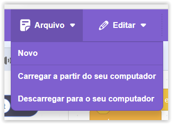

## Desafio

\--- challenge ---

Segue os passos anteriores para fazer com que o assistente controle também a luz.

\--- task ---

- Guarda uma cópia do teu projeto Scratch no teu computador para que possas recarregá-lo facilmente mais tarde e utilizá-lo com o teu novo modelo.

\--- /task ---

\--- task ---

- Volta ao teu modelo (**Voltar ao projeto** > **Treinar**) e adiciona mais dois rótulos: "luz_ligada" e "luz_desligada".

\--- /task ---

\--- task ---

- Acrescenta oito exemplos de comandos que podes utilizar para acender a luz.

\--- /task ---

\--- task ---

- Acrescenta oito exemplos de comandos que podes utilizar para desligar a luz.

\--- /task ---

\--- task ---

- Treina novamente o teu modelo (**Voltar ao projeto** > **Aprender e testar**) para que possas também reconhecer comandos para ligar e desligar a luz.

\--- /task ---

\--- task ---

- Carrega o teu novo modelo no Scratch (**Criar** > **Scratch 3** > **Abre no Scratch 3**).

- No Scratch, recarrega o código que anteriormente guardaste (**Ficheiro** > **Carregar do meu computador**).

- Adiciona mais dois blocos "se" ao teu programa para que possas escrever comandos para controlar a luz.

## --- collapse ---

## title: Não consigo ver os blocos para luz_ligada/luz_desligada

Se treinaste um novo modelo, será necessário fechar o Scratch e reabrir na página Machine Learning for Kids para aparecerem os novos blocos.

Clica em **Criar** > **Scratch 3** > **Abre no Scratch 3**.

\--- /collapse ---

\--- /task ---

\--- task ---

- Testa se o teu programa funciona, ao escrever comandos para ligar e desligar a luz e verifica se o resultado é o esperado.

\--- /task ---

\--- /challenge ---
