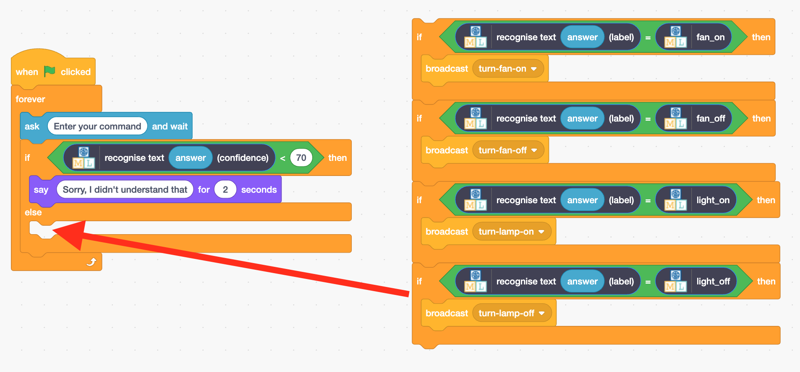

## Índice de confiança

<html>
  

    <iframe style="position: absolute; top: 0; left: 0; right: 0; width: 100%; height: 100%; border: none;" src="https://www.youtube.com/embed/ZvRBzkMUDlM?rel=0&cc_load_policy=1" allowfullscreen allow="accelerometer; autoplay; clipboard-write; encrypted-media; gyroscope; picture-in-picture; web-share"></iframe>
  

</html>

O modelo pode dizer-lhe o quão **confiante** está sobre se está correto.

\--- task ---

- Volta à página **Aprender e Testar** na ferramenta de Treino.

- Escreve algo que não tenha nada a ver com lâmpadas ou ventoinhas na caixa de teste. Podes escrever, por exemplo, "toca uma música".

\--- /task ---

A **pontuação de confiança** é a forma do programa te dizer a probabilidade de ter rotulado o comando corretamente.

\--- task ---

- Regressar ao Scratch.

- Acrescenta código para que o assistente te diga que não compreendeu o comando se a pontuação de confiança for inferior a 70%.

\--- /task ---

\--- task ---

- Clica na **bandeira verde** e testa o teu programa para verificar se o teu assistente reage da forma correta:
  - Introduz comandos que não tenham nada a ver com o ventilador ou a lâmpada
  - Pede para ligar ou desligar alguma coisa

\--- /task ---
