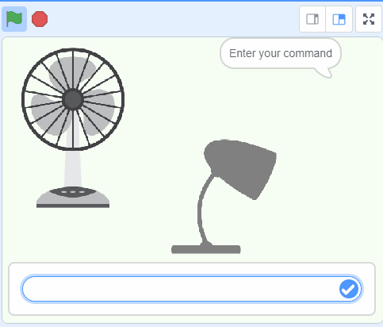

## Ne yapacaksınız

Komutlarınıza yanıt veren akıllı bir sanal asistan oluşturun.

\--- collapse ---

---

## Başlık: Komutlarım nerede saklanıyor?

- Bu proje 'makine öğrenimi' adı verilen bir teknolojiyi kullanıyor. Makine öğrenimi sistemleri büyük miktarda veri kullanılarak eğitilir.
- Bu proje için hesap oluşturmanız veya giriş yapmanız gerekmiyor. Bu proje için, modeli oluşturmak üzere kullandığınız resim örnekleri yalnızca geçici olarak tarayıcınızda (yalnızca bilgisayarınızda) saklanır.
  \--- /collapse ---

## --- collapse ---

## başlık: YouTube hesabınız yok mu? Videoları indirin!

[Bu proje için tüm videoları](https://rpf.io/p/en/smart-assistant-go){:target="_blank"} indirebilirsiniz.

\--- /collapse ---

## --- collapse ---

## Başlık: Lisans

Bu proje hem [Creative Commons Attribution Non-Commercial Share-Alike License](http://creativecommons.org/licenses/by-nc-sa/4.0/){:target="_blank"} hem de [Apache License Version 2.0](http://www.apache.org/licenses/LICENSE-2.0){:target="_blank"} lisansları altındadır.

Bu projeye yaptığı tüm katkılardan dolayı machinelearningforkids.co.uk adresinden Dale'e teşekkür etmek isteriz.

\--- /collapse ---