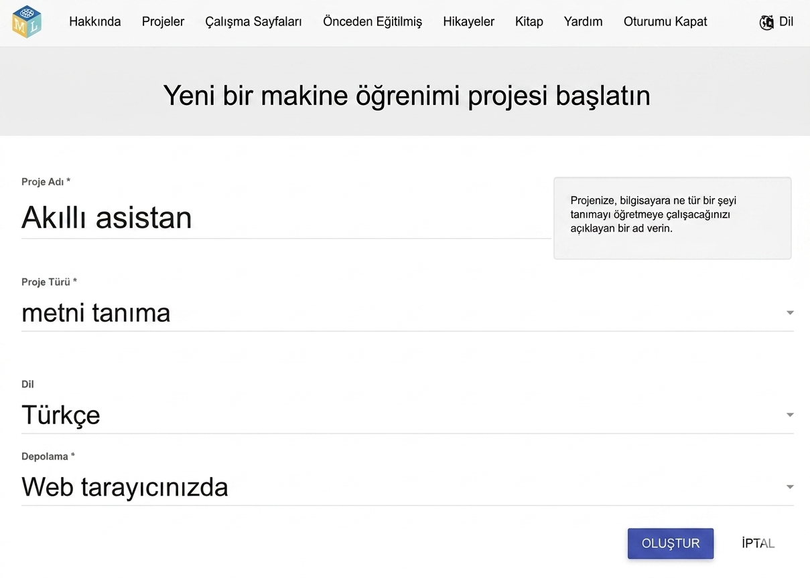
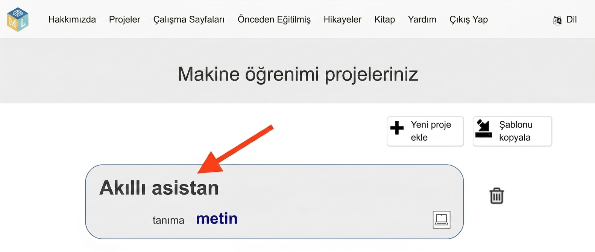
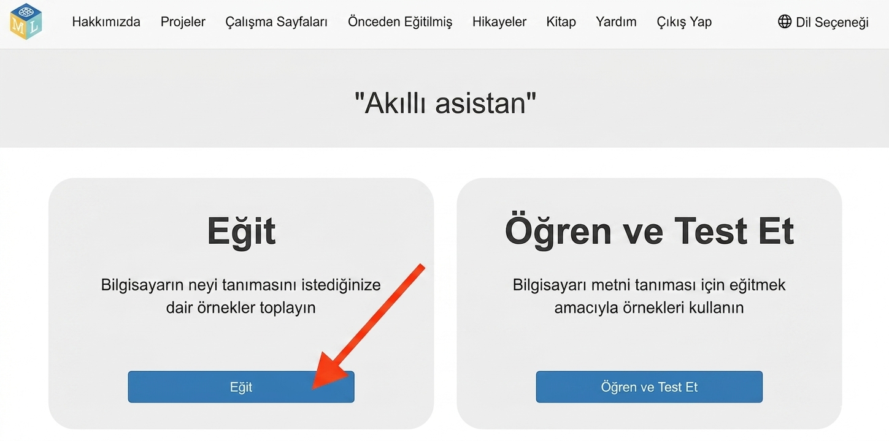

## Modeli kurun

<html>
  

    <iframe style="position: absolute; top: 0; left: 0; right: 0; width: 100%; height: 100%; border: none;" src="https://www.youtube.com/embed/aTKd6sH3PhM?rel=0&cc_load_policy=1" allowfullscreen allow="accelerometer; autoplay; clipboard-write; encrypted-media; gyroscope; picture-in-picture; web-share"></iframe>
  

</html>

--- task ---

- Bir web tarayıcısında [machinelearningforkids.co.uk](https://machinelearningforkids.co.uk/){:target="_blank"} adresine gidin.

- **Başla** seçeneğine tıklayın.

- 'Şimdi dene'ye tıklayın.

--- /task ---

--- task ---

- Üstteki menü çubuğunda **Projeler**'e tıklayın.

- **+ Yeni proje ekle** düğmesine tıklayın.

- Projenize `Akıllı Asistan` adını verin ve **metin** tanımayı öğrenmesini ve verileri **web tarayıcınızda** saklamasını sağlayacak şekilde ayarlayın. Ardından **Oluştur**'a tıklayın.

- Projeler listesinde artık 'Akıllı asistan'ı görebiliyor olmalısınız. Projeye tıklayın.

--- /task ---

--- task ---

- **Eğit** düğmesine tıklayın.

--- /task ---
