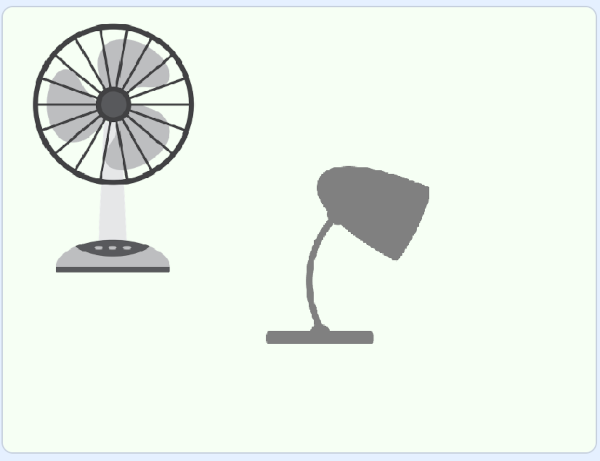
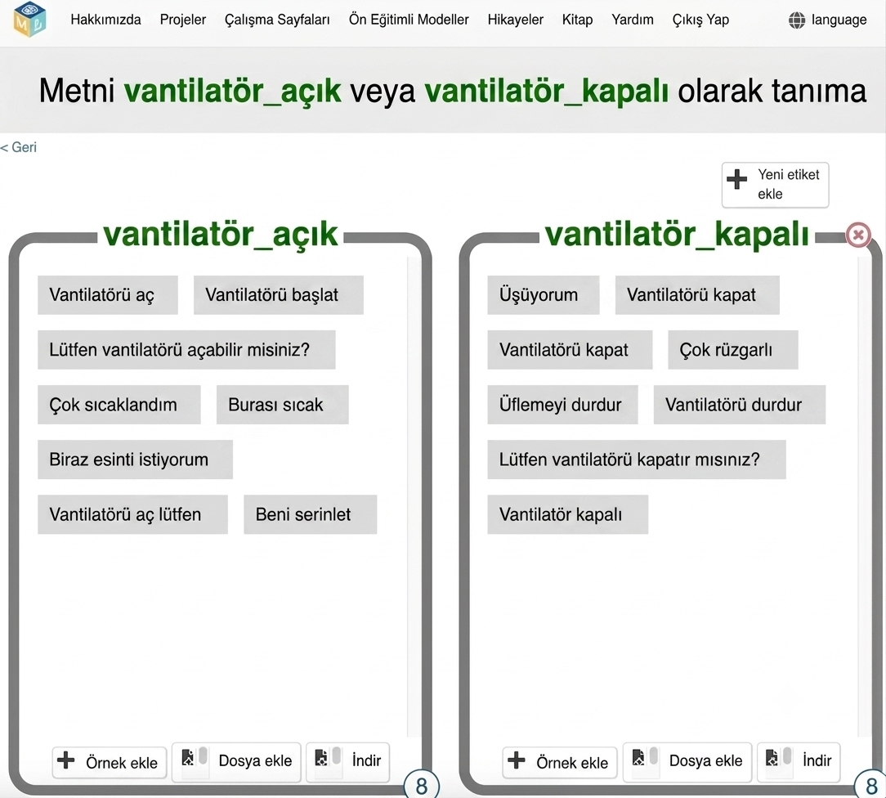

## Örnek komutlar

<html>
  

    <iframe style="position: absolute; top: 0; left: 0; right: 0; width: 100%; height: 100%; border: none;" src="https://www.youtube.com/embed/aekrXl_-Q_o?rel=0&cc_load_policy=1" allowfullscreen allow="accelerometer; autoplay; clipboard-write; encrypted-media; gyroscope; picture-in-picture; web-share"></iframe>
  

</html>

Odada iki cihaz var: bir vantilatör ve bir lamba.

Asistanınızın, her bir cihazın açılıp kapatılmasını istediğinizde söyleyebileceğiniz ifadelerin bazı örneklerine ihtiyacı var. Örneğin, **vantilatörü çalıştırmak** için şöyle diyebilirsiniz:

- "Vantilatörü aç"
- "Vantilatörü çalıştır"
- "Lütfen vantilatörü çalıştırır mısın?"
- "Çok sıcakladım"
- "Burası çok sıcak."

--- task ---

- Sağ üst köşedeki **+ Yeni etiket ekle** seçeneğine tıklayın ve “vantilatör açık” etiketini ekleyin.

--- /task ---

--- task ---

- **Örnek ekle** seçeneğine tıklayın ve `Vantilatörü aç` yazın.

--- /task ---

--- task ---

- **Örnek Ekle** düğmesine tıklamaya devam edin ve vantilatörün açılmasını istemenin farklı yollarını ekleyerek sekiz farklı istekte bulunana kadar ilerleyin.

--- /task ---

--- task ---

- **Yeni etiket ekle** seçeneğine tıklayın, ancak bu sefer "vantilatör kapalı" etiketini oluşturun. Vantilatörün kapatılmasını isteyebileceğiniz sekiz farklı örnek ekleyin.

--- /task ---

