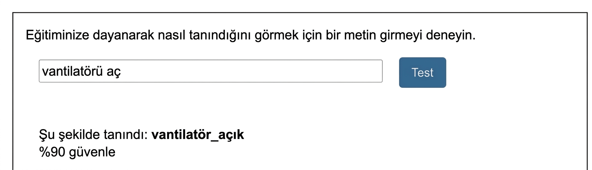

## Modeli eğitin

<html>
  

    <iframe style="position: absolute; top: 0; left: 0; right: 0; width: 100%; height: 100%; border: none;" src="https://www.youtube.com/embed/62B6yHRVmmg?rel=0&cc_load_policy=1" allowfullscreen allow="accelerometer; autoplay; clipboard-write; encrypted-media; gyroscope; picture-in-picture; web-share"></iframe>
  

</html>

Artık elinizde bazı örnek veriler olduğuna göre, makine öğrenimi modelini bu örneklere dayanarak bir komutu 'vantilatör açık' veya 'vantilatör kapalı' olarak etiketleyecek şekilde eğitebilirsiniz.

--- task ---

- **< Projeye geri dön** bağlantısına tıklayın, ardından **Öğren ve Test Et** seçeneğine tıklayın.

--- /task ---

--- task ---

- **Yeni makine öğrenimi modelini eğit** düğmesine tıklayın.

--- /task ---

Eğitimin tamamlanmasını bekleyin — bu bir iki dakika sürebilir. Eğitim tamamlandıktan sonra bir test kutusu görünür.

--- task ---

- `Vantilatör aç` yazın ve modelin bu girişi 'vantilatör açık' olarak etiketlediğini kontrol edin.

--- /task ---

--- task ---

- Vantilatörü açıp kapatmak için başka komutlar yazmayı deneyin ve beklediğiniz etiketin verilip verilmediğini kontrol edin.

--- /task ---

Bilgisayarın komutları tanıma şeklinden memnun değilseniz, önceki adıma geri dönün ve birkaç örnek daha ekleyin. Ardından **yeni makine öğrenimi modelini** tekrar eğitin.

