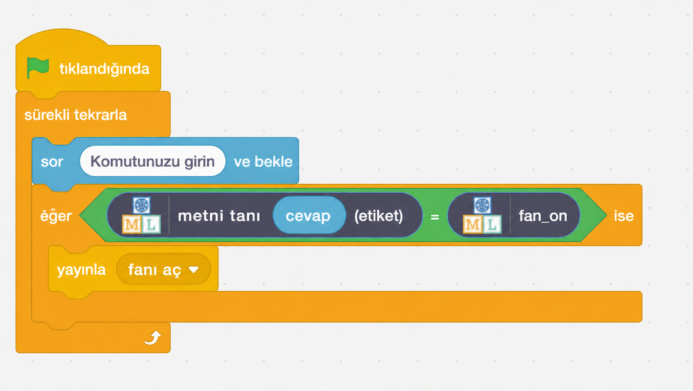
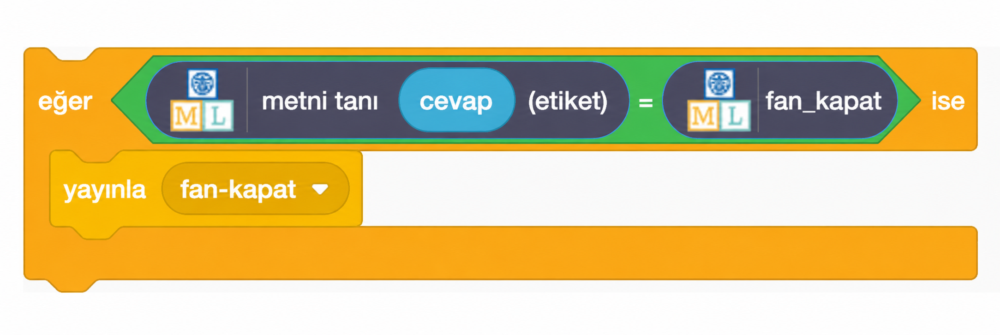

## Asistanı oluşturun

<html>
  

    <iframe style="position: absolute; top: 0; left: 0; right: 0; width: 100%; height: 100%; border: none;" src="https://www.youtube.com/embed/R3e8nX4vKXo?rel=0&cc_load_policy=1" allowfullscreen allow="accelerometer; autoplay; clipboard-write; encrypted-media; gyroscope; picture-in-picture; web-share"></iframe>
  

</html>

Modeliniz artık komutları ayırt edebildiğine göre, onu Scratch programında kullanarak akıllı asistanınızı oluşturabilirsiniz.

--- task ---

- **< Projeye geri dön** bağlantısına tıklayın.

- **Oluştur** seçeneğine tıklayın.

- **Scratch 3**'e tıklayın.

- **Scratch 3'te Aç** seçeneğine tıklayın.

--- /task ---

--- task ---

- En üstte bulunan **Proje şablonları**'na tıklayın ve vantilatör ve ışık görsellerini yüklemek için 'Akıllı sınıf' projesini seçin. Bu proje ayrıca **Etkinlikler** başlığı altında bulunabilen önceden hazırlanmış sarı `yayın` blokları da içermektedir.

--- /task ---

Çocuklar için Makine Öğrenimi, yeni eğittiğiniz modeli kullanmanıza olanak sağlamak için Scratch'e bazı özel bloklar ekledi. Onları blok listesinin en altında bulabilirsiniz.

--- task ---

- **Sınıf** görselini seçtiğinizden emin olun, ardından **Kod** sekmesine tıklayın ve şu kodu ekleyin:

--- /task ---

--- task ---

- `eğer` bloğuna sağ tıklayın ve **Çoğalt** seçeneğini seçerek kod bloğunun tamamının bir kopyasını ekleyin ve ilk `eğer` bloğunun hemen altına yerleştirin.

- Bloğun ikinci kopyasını, vantilatörü **kapatma** metnini tanıyacak ve **vantilatörü-kapat** komutunu yayınlayacak şekilde değiştirin.

--- /task ---

--- task ---

- **Yeşil bayrağa** tıklayın ve vantilatörü açmak veya kapatmak için bir komut yazın. Beklediğiniz sonucu verdiğinden emin olun.

- Yardımcının, örnek olarak eklemediğiniz komutlar için bile doğru işlemi gerçekleştirdiğinden emin olun.

--- /task ---
