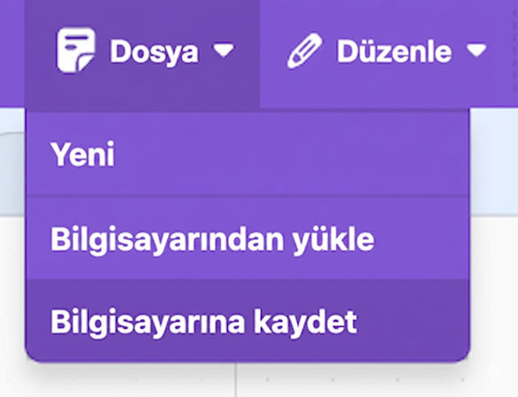

## Meydan okuma

--- challenge ---

Asistanın ışığı kontrol edebilmesi için önceki adımları aynen izleyin.

--- task ---

- Scratch projenizin bir kopyasını bilgisayarınıza kaydedin, böylece daha sonra yeni modelinizle kullanmak üzere kolayca yeniden yükleyebilirsiniz.

--- /task ---

--- task ---

- Modelinize geri dönün (**Projeye geri dön** > **Eğit**) ve `ışık_açık` ve `ışık_kapalı` olmak üzere iki etiket daha ekleyin.

--- /task ---

--- task ---

- Işığı açmak için kullanabileceğiniz sekiz komut örneği ekleyin.

--- /task ---

--- task ---

- Işığı kapatmak için kullanabileceğiniz sekiz komut örneği ekleyin.

--- /task ---

--- task ---

- Modelinizi yeniden eğitin (**Projeye geri dön** > **Öğren ve Test Et**), böylece ışığı açma ve kapatma komutlarını da tanıyabilir.

--- /task ---

--- task ---

- Yeni modelinizi Scratch'e yükleyin (**Oluştur** > **Scratch 3** > **Scratch 3'te Aç**).

- Scratch'te, daha önce kaydettiğiniz kodu yeniden yükleyin (**Dosya** > **Bilgisayarımdan Yükle**).

- Işığı kontrol etmek için komutlar yazabilmeniz amacıyla programınıza iki adet daha `eğer` bloğu ekleyin.

--- collapse ---
---
title: ışık_açık / ışık_kapalı için blokları göremiyorum
---

Yeni bir model eğittiyseniz, yeni blokların görünmesi için Scratch'i kapatıp ardından Çocuklar için Makine Öğrenmesi web sitesinden yeniden açmanız gerekecektir.

**Oluştur** > **Scratch 3** > **Scratch 3'te Aç** seçeneğine tıklayın.

--- /collapse ---

--- /task ---

--- task ---

- Programınızın çalışıp çalışmadığını test etmek için, ışığı açıp kapatmak üzere komutlar yazın ve sonucun beklediğiniz gibi olup olmadığını kontrol edin.

--- /task ---

--- /challenge ---
