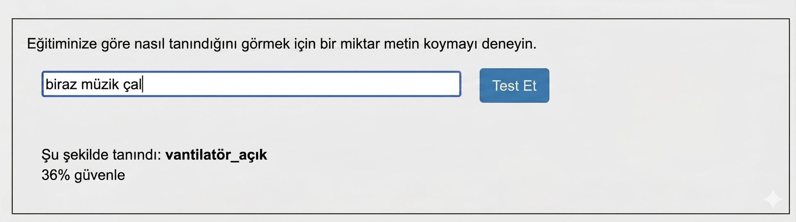
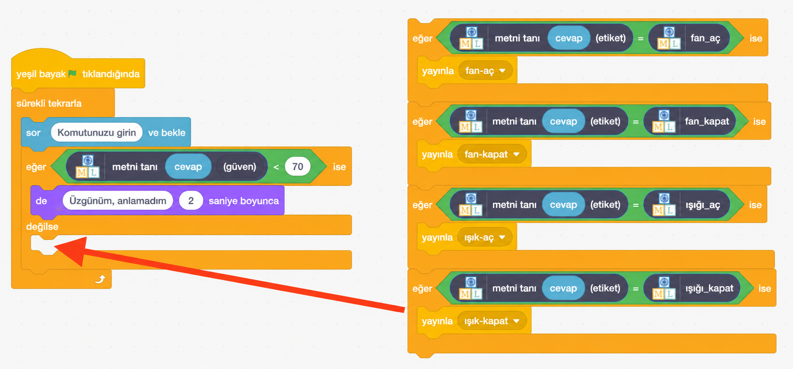

## Güven puanları

<html>
  

    <iframe style="position: absolute; top: 0; left: 0; right: 0; width: 100%; height: 100%; border: none;" src="https://www.youtube.com/embed/ZvRBzkMUDlM?rel=0&cc_load_policy=1" allowfullscreen allow="accelerometer; autoplay; clipboard-write; encrypted-media; gyroscope; picture-in-picture; web-share"></iframe>
  

</html>

Model, doğru olup olmadığı konusunda ne kadar **emin** olduğunu size söyleyebilir.

\--- task ---

- Eğitim aracındaki **Öğren ve Test Et** sayfasına geri dönün.

- Test kutusuna lambalar veya vantilatörlerle hiçbir ilgisi olmayan bir şey yazın. Örneğin, 'müzik çal' yazabilirsiniz.

\--- /task ---

**Güvenilirlik puanı**, programın komutu doğru şekilde etiketleme olasılığının ne kadar yüksek olduğunu size bildirme şeklidir.

\--- task ---

- Scratch'e geri dön.

- Asistanın, güven puanı %70'in altında ise komutu anlamadığını bildirmesi için yeni bir kod ekleyin.

\--- /task ---

\--- task ---

- **Yeşil bayrağa** tıklayın ve asistanınızın doğru şekilde tepki verip vermediğini kontrol etmek için programınızı test edin:
  - Vantilatör veya lamba ile hiçbir ilgisi olmayan komutlar yazın
  - Bir şeyin açılıp kapatılmasını isteyin

\--- /task ---
