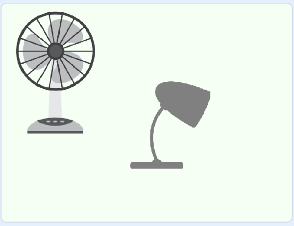
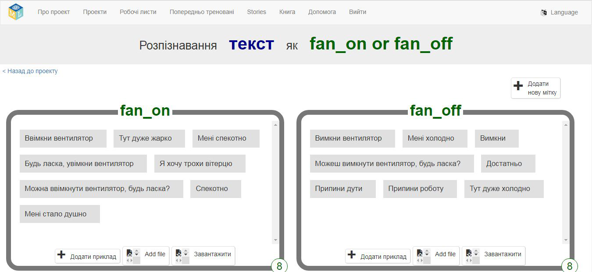

## Приклади команд

<html>
  

    <iframe style="position: absolute; top: 0; left: 0; right: 0; width: 100%; height: 100%; border: none;" src="https://www.youtube.com/embed/aekrXl_-Q_o?rel=0&cc_load_policy=1" allowfullscreen allow="accelerometer; autoplay; clipboard-write; encrypted-media; gyroscope; picture-in-picture; web-share"></iframe>
  

</html>

У кімнаті є два пристрої: вентилятор і лампа.

Твоєму помічнику потрібні варіанти фраз, які ти можеш використати, коли хочеш увімкнути або вимкнути кожен пристрій. Щоб **увімкнути вентилятор**, можна сказати:

- «Увімкни вентилятор»
- «Увімкни вентилятор»
- «Будь ласка, ввімкни вентилятор»
- «Мені дуже спекотно»
- «Тут жарко»

\--- task ---

- Натисни **+ Додати нову позначку** у правому верхньому куті та додай позначку «вентилятор увімкнено».

\--- /task ---

\--- task ---

- Натисни **Додати приклад** і впиши «Увімкнути вентилятор».

\--- /task ---

\--- task ---

- Натискай знову на **Додати приклад** і додавай різні способи увімкнути вентилятор, поки не матимеш вісім різних варіантів.

\--- /task ---

\--- task ---

- Натисни **Додати нову позначку**, але цього разу створи «вимкнути вентилятор». Додай вісім різних варіантів того, як можна попросити вимкнути вентилятор.

\--- /task ---

