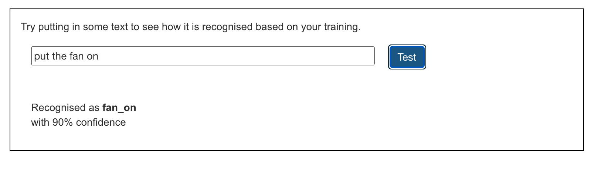

## Навчи модель

<html>
  

    <iframe style="position: absolute; top: 0; left: 0; right: 0; width: 100%; height: 100%; border: none;" src="https://www.youtube.com/embed/62B6yHRVmmg?rel=0&cc_load_policy=1" allowfullscreen allow="accelerometer; autoplay; clipboard-write; encrypted-media; gyroscope; picture-in-picture; web-share"></iframe>
  

</html>

Тепер, на основі твоїх варіантів, ти можеш навчити модель машинного навчання позначати команди як «увімкнути вентилятор» або «вимкнути вентилятор».

\--- task ---

- Натисни **< Назад до проєкту**, а потім на **Дізнатися та перевірити**.

\--- /task ---

\--- task ---

- Натисни кнопку **Навчити нову модель машинного навчання**.

\--- /task ---

Зачекай, поки завершиться навчання — це може зайняти хвилину-дві. Після завершення навчання з'являється тестове вікно.

\--- task ---

- Впиши «увімкнути вентилятор» і перевір, чи модель позначає цей запит як «вентилятор увімкнено».
  

\--- /task ---

\--- task ---

- Спробуй ввести інші команди для ввімкнення та вимкнення вентилятора і перевір, чи вони відповідають очікуваним позначкам.

\--- /task ---

Якщо тобі не подобається, як комп'ютер розпізнає команди, повернись до попереднього кроку та додай ще кілька варіантів. Потім знову **навчи нову модель машинного навчання**.

