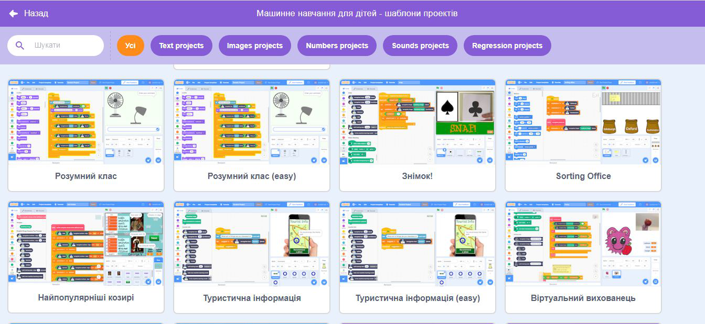
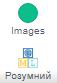
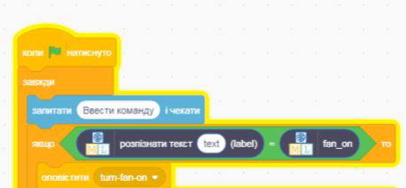

## Створи помічника

<html>
  

    <iframe style="position: absolute; top: 0; left: 0; right: 0; width: 100%; height: 100%; border: none;" src="https://www.youtube.com/embed/R3e8nX4vKXo?rel=0&cc_load_policy=1" allowfullscreen allow="accelerometer; autoplay; clipboard-write; encrypted-media; gyroscope; picture-in-picture; web-share"></iframe>
  

</html>

Тепер, коли твоя модель може розрізняти команди, ти можеш використати її в програмі Скретч для створення розумного помічника.

\--- task ---

- Натисни на **< Назад до проєкту**.

- Натисни на кнопку **Створити**.

- Натисни на **Scratch 3**.

- Натисни **Відкрити в Scratch 3**.

\--- /task ---

\--- task ---

- Натисни на **Шаблони проєктів** вгорі та вибери проєкт «Розумна класна кімната», щоб завантажити спрайти вентилятора та лампи. Цей проєкт також містить готові жовті блоки «трансляції», які можна знайти в розділі **Події**.

\--- /task ---

Програма «Машинне навчання для дітей» додала до Скретч кілька спеціальних блоків, які дозволяють використовувати щойно навчену модель. Знайди їх внизу списку з блоками.

\--- task ---

- Перевір, чи обрав саме спрайт **Клас**, потім клацни вкладку **Код** і додай цей код:

\--- /task ---

\--- task ---

- Натисни правою кнопкою миші на блоці `if` і вибери **Дублювати**, щоб додати копію всього блоку коду і розмістити її безпосередньо під першим `if`.

- Зміни другу копію блоку так, щоб він розпізнавав текст для вимкнення вентилятора **off** і передавав **turn-fan-off**.

\--- /task ---

\--- task ---

- Клацни на **зелений прапорець** і введи команду, щоб увімкнути або вимкнути вентилятор. Перевір, чи ти отримав очікуваний результат.

- Переконайся, що асистент виконує правильні дії **навіть для команд, які ти не додавав як варіанти**.

\--- /task ---
