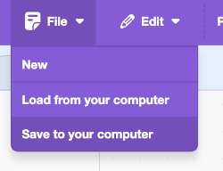

## Додаткове завдання

\--- challenge ---

Повтори ті самі кроки, що й раніше, щоб асистент міг також керувати освітленням.

\--- task ---

- Збережи копію свого проєкту Scratch на комп'ютері, щоб пізніше можна було легко завантажити його для використання з новою моделлю.

\--- /task ---

\--- task ---

- Повернися до своєї моделі (**Назад до проєкту** > **Навчити**) і додай ще дві мітки: `light_on` та `light_off`.

\--- /task ---

\--- task ---

- Додай вісім прикладів команд, які ти можеш використовувати, щоб увімкнути світло.

\--- /task ---

\--- task ---

- Додай вісім прикладів команд, які ти можеш використовувати, щоб вимкнути світло.

\--- /task ---

\--- task ---

- Перевчи свою модель (**Назад до проєкту** > **Навчання та тестування**), щоб вона також могла розпізнавати команди для вмикання та вимикання світла.

\--- /task ---

\--- task ---

- Завантаж свою нову модель у Scratch (**Створити** > **Scratch 3** > **Відкрити у Scratch 3**).

- У Scratch завантаж код, який ти зберіг раніше (**Файл** > **Завантажити з мого комп'ютера**).

- Додай до своєї програми ще два блоки `if`, щоб ти міг вводити команди для керування світлом.

## --- collapse ---

## заголовок: Я не бачу блоків для light_on / light_off

Якщо ти навчив нову модель, тобі потрібно закрити Scratch, а потім знову відкрити його з вебсайту Machine Learning for Kids, щоб з'явилися нові блоки.

Клацни **Створити** > **Scratch 3** > **Відкрити в Scratch 3**.

\--- /collapse ---

\--- /task ---

\--- task ---

- Перевір, чи працює твоя програма, ввівши команди для ввімкнення та вимкнення світла і перевіривши, чи результат відповідає твоїм очікуванням.

\--- /task ---

\--- /challenge ---
