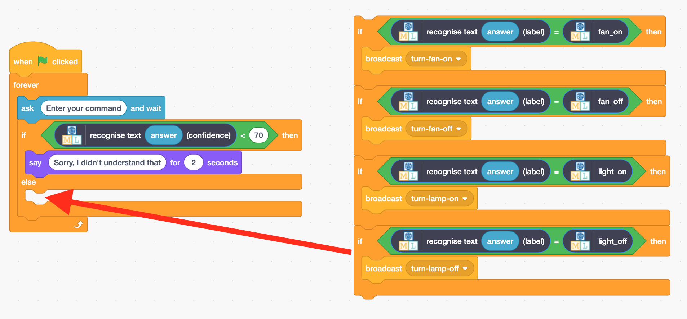

## Оцінка ефективності

<html>
  

    <iframe style="position: absolute; top: 0; left: 0; right: 0; width: 100%; height: 100%; border: none;" src="https://www.youtube.com/embed/ZvRBzkMUDlM?rel=0&cc_load_policy=1" allowfullscreen allow="accelerometer; autoplay; clipboard-write; encrypted-media; gyroscope; picture-in-picture; web-share"></iframe>
  

</html>

Модель може повідомити тобі, наскільки вона **впевнена** у правильності своїх висновків.

\--- task ---

- Повернися до сторінки **Навчання та тестування** в навчальному інструменті.

- Введи у тестове поле щось таке, що не має нічого спільного з лампами або вентиляторами. Наприклад, ти можеш ввести «увімкни музику».

\--- /task ---

**Оцінка ефективності** — це спосіб, яким програма повідомляє вам, наскільки ймовірно, що вона правильно розпізнала команду.

\--- task ---

- Повернись до Scratch.

- Додай новий код, щоб асистент повідомляв про те, що він не зрозумів команду, якщо рівень ефективності становить менше ніж 70%.

\--- /task ---

\--- task ---

- Клацни на **зелений прапорець** і перевір свою програму, щоб переконатися, що твій  помічник реагує правильно:
  - Введи команди, які не мають нічого спільного з вентилятором або лампою
  - Попроси щось увімкнути або вимкнути

\--- /task ---
